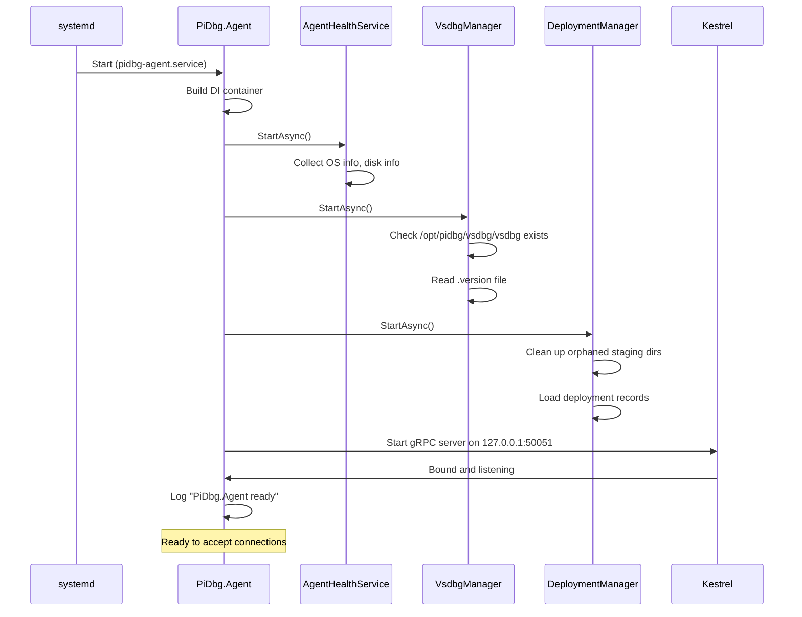
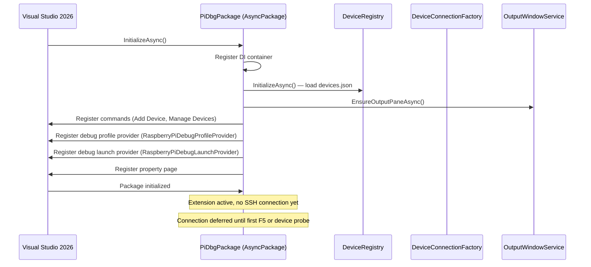
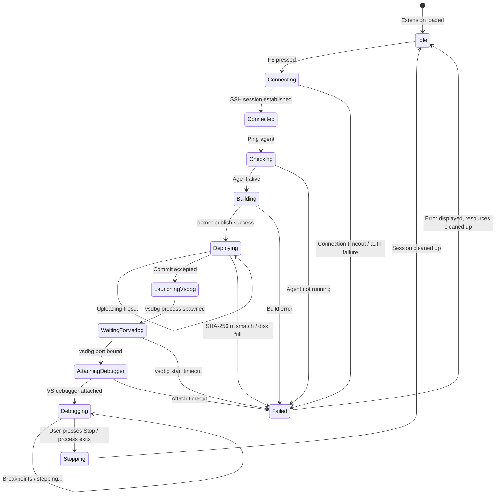
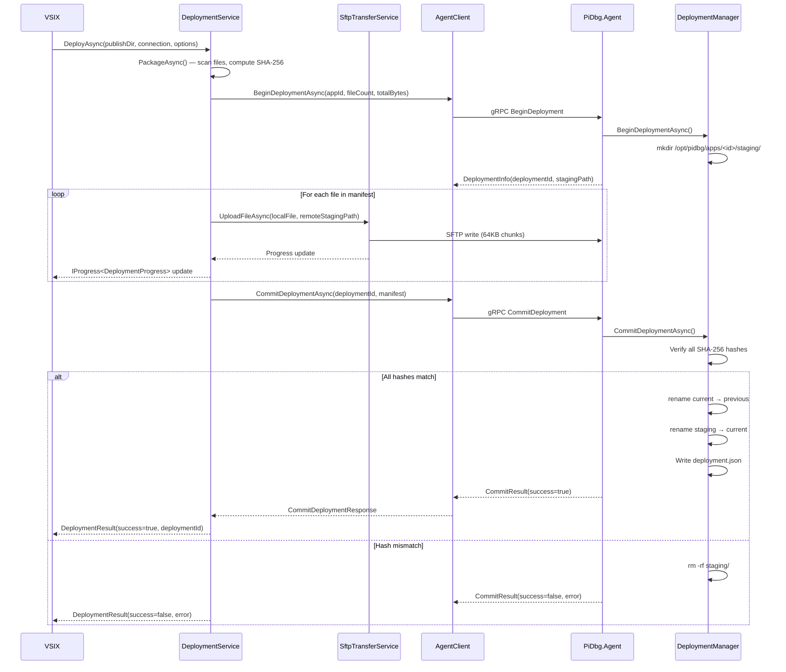
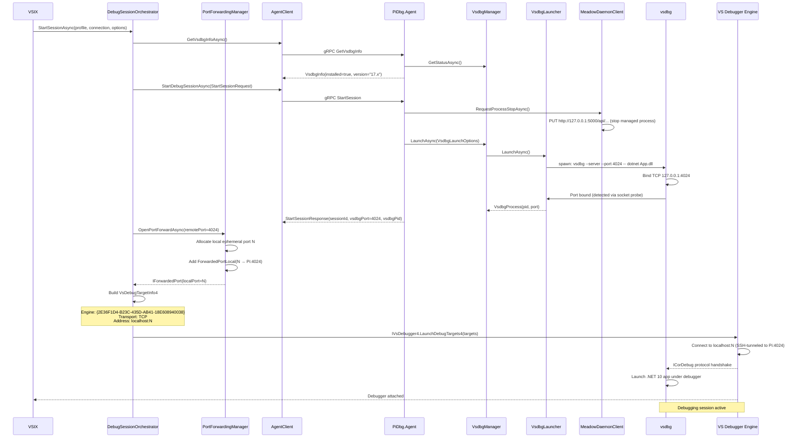
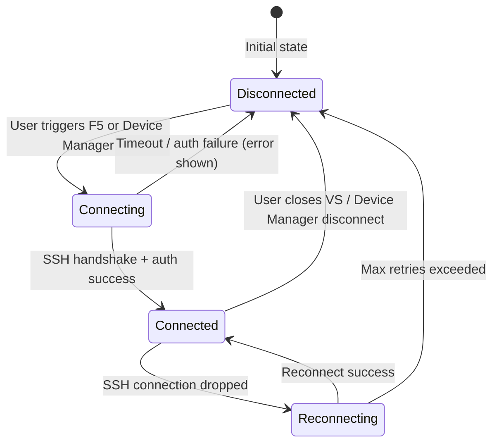
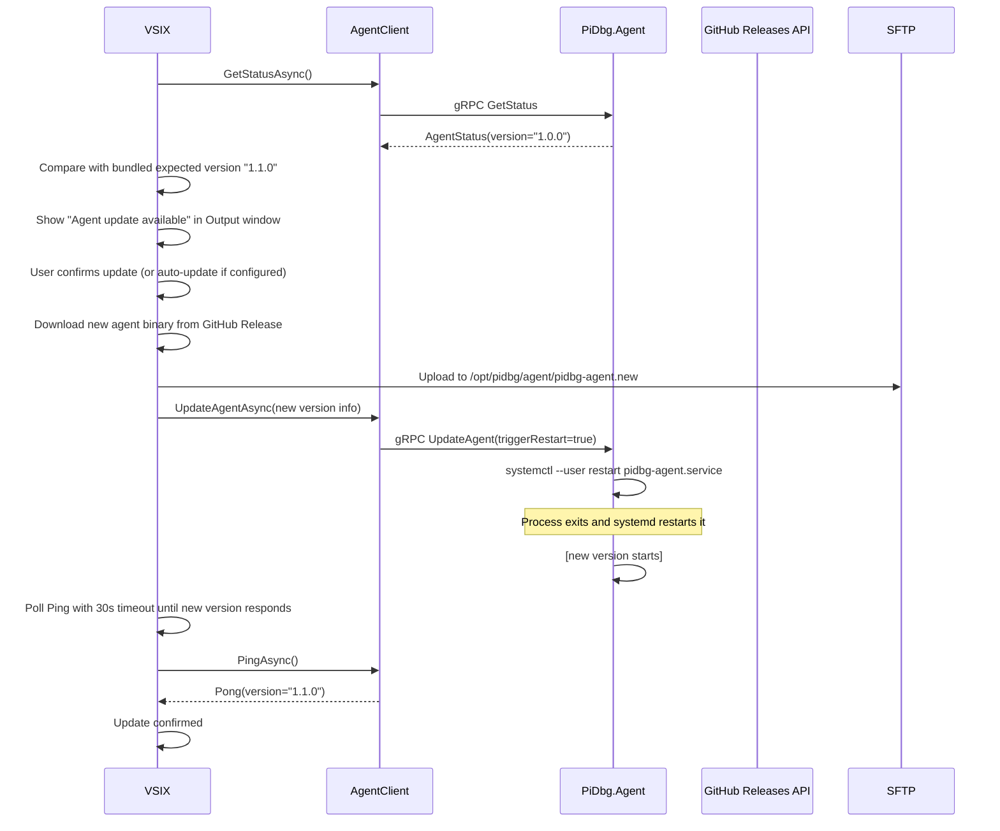

# PiDbg — Lifecycle Diagrams

All diagrams use Mermaid syntax (render in GitHub, VS Code with Mermaid extension, etc.)

---

## 1. Agent Startup Sequence

---

## 2. VS Extension Load Sequence

---

## 3. Full Debug Session Lifecycle

---

## 4. Deployment Lifecycle

---

## 5. vsdbg Attach Flow

---

## 6. Connection State Machine

---

## 7. Agent Self-Update Lifecycle

