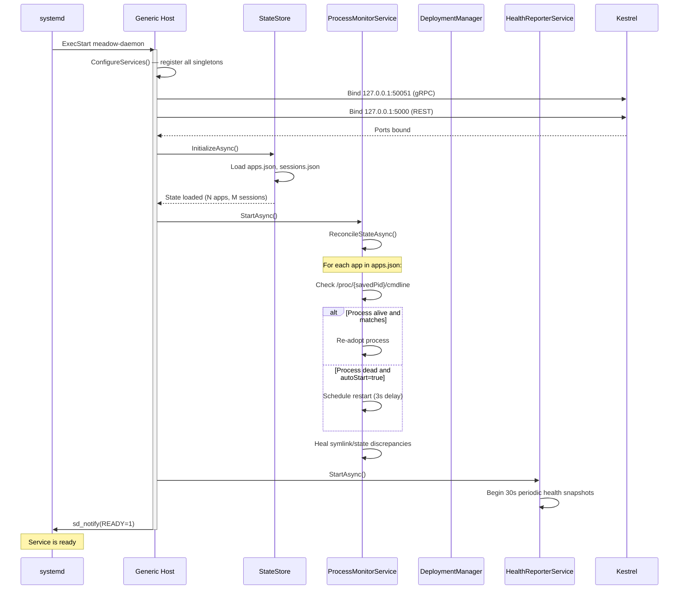
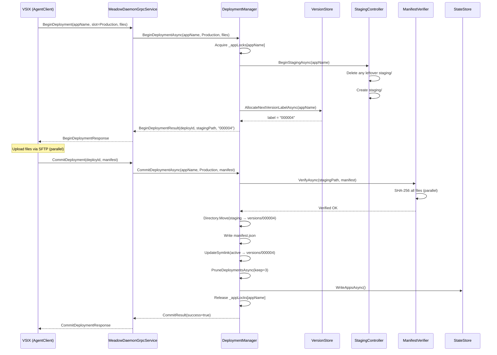
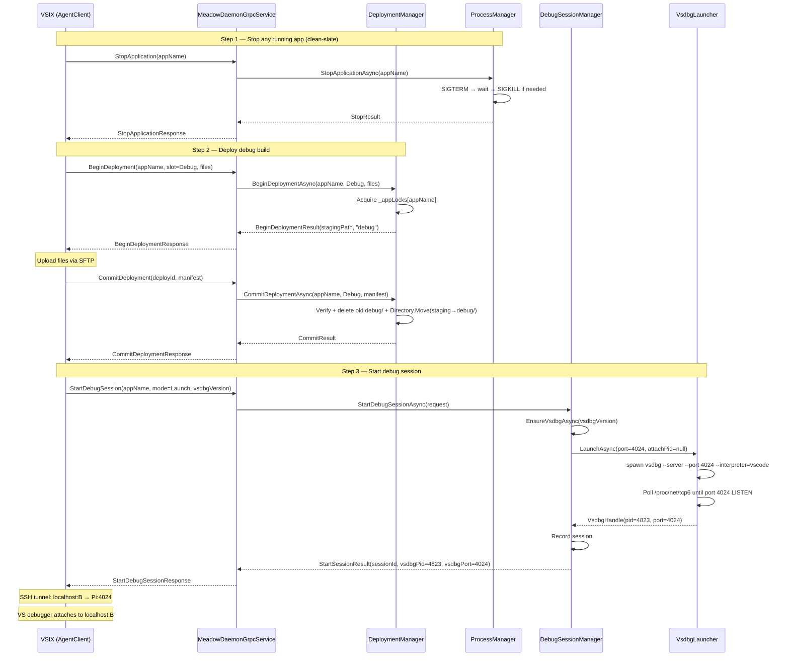
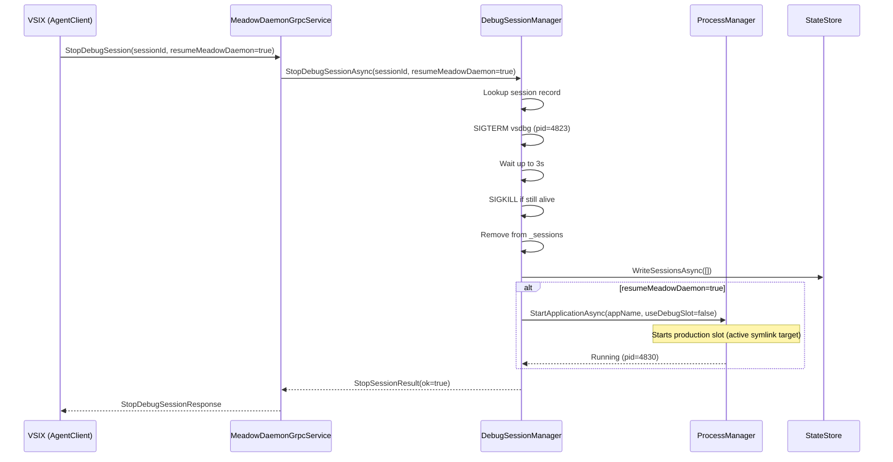
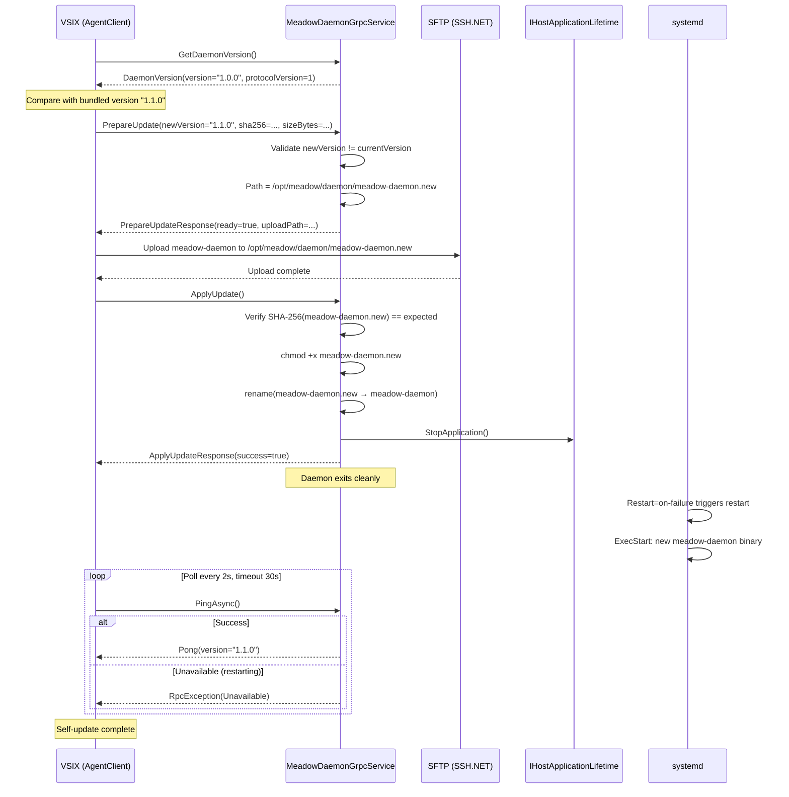
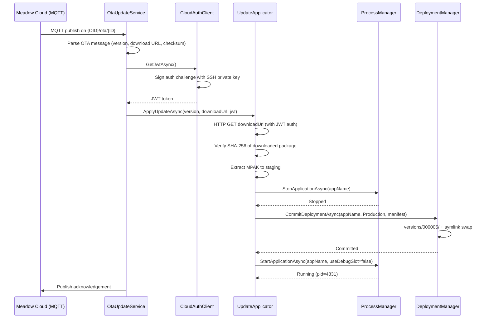
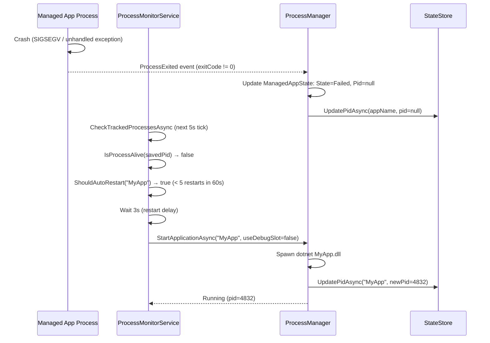

# Meadow.Daemon — Lifecycle Sequence Diagrams

---

## 1. Daemon Startup

---

## 2. Production Deployment (via gRPC from VSIX)

---

## 3. Debug Deployment + Session Start

---

## 4. Stop Debug Session

---

## 5. Daemon Self-Update

---

## 6. OTA Update (Cloud Path)

---

## 7. Process Auto-Restart (Crash Recovery)

