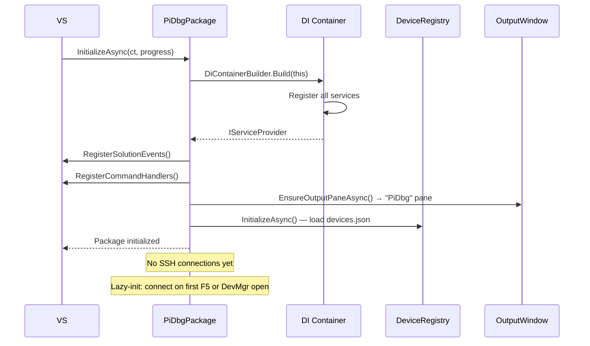

# PiDbg VSIX — Extension Architecture

---

## 1. Overview

The VSIX extension is a traditional in-process `AsyncPackage` targeting `net472`. This
choice is deliberate: the VS 2026 debugger APIs (`IVsDebugger4`), CPS launch provider
contracts, and MEF composition all require in-process access. The newer out-of-process
`VisualStudio.Extensibility` model cannot yet surface the deep debugger hooks needed.

The extension owns everything on the developer machine: UI, device registry, SSH transport,
deployment orchestration, and the VS debugger attach call. It delegates on-device work to
`PiDbg.Agent` via gRPC over an SSH tunnel.

---

## 2. Package Layout

```
PiDbg.Vsix/
│
├── PiDbgPackage.cs                    # AsyncPackage entry point
├── PiDbgPackage.vsct                  # Command table (menus, toolbars, keybindings)
├── source.extension.vsixmanifest
│
├── Debug/                             # VS debugger integration (§02)
│   ├── RaspberryPiDebugger.cs         # Constants: CommandName, EngineGuid, SchemaName
│   ├── RaspberryPiLaunchProvider.cs   # IDebugLaunchProvider impl (MEF-exported)
│   ├── RaspberryPiLaunchProviderMef.cs # Thin MEF shell → DI resolution
│   ├── RaspberryPiProfileProvider.cs  # ILaunchSettingsUIProvider (MEF-exported)
│   ├── RaspberryPiLaunchProfile.cs    # Typed wrapper over ILaunchProfile.OtherSettings
│   └── DebugSessionOrchestrator.cs    # Drives full F5 sequence
│
├── ProjectSystem/                     # CPS integration (§03)
│   ├── RaspberryPiLaunchSettingsProvider.cs
│   ├── RaspberryPiProfileUIProvider.cs
│   └── LaunchProfileSerializer.cs
│
├── UI/                                # All WPF UI (§04)
│   ├── DeviceManager/
│   │   ├── DeviceManagerWindow.cs     # ToolWindowPane
│   │   ├── DeviceManagerWindowControl.xaml
│   │   ├── DeviceManagerWindowControl.xaml.cs
│   │   ├── AddEditDeviceDialog.xaml
│   │   ├── AddEditDeviceDialog.xaml.cs
│   │   └── ViewModels/
│   │       ├── DeviceManagerViewModel.cs
│   │       ├── DeviceItemViewModel.cs
│   │       └── AddEditDeviceViewModel.cs
│   ├── PropertyPage/
│   │   ├── RaspberryPiPropertyPageView.xaml
│   │   ├── RaspberryPiPropertyPageView.xaml.cs
│   │   └── RaspberryPiPropertyPageViewModel.cs
│   ├── DeployProgress/
│   │   ├── DeployProgressBar.xaml     # Embedded in Output window toolbar
│   │   └── DeployProgressViewModel.cs
│   └── LogViewer/
│       ├── LogViewerWindow.cs         # ToolWindowPane
│       ├── LogViewerWindowControl.xaml
│       └── LogViewerViewModel.cs
│
├── Commands/                          # Menu/toolbar commands (§04)
│   ├── CommandBase.cs
│   ├── OpenDeviceManagerCommand.cs
│   ├── OpenLogViewerCommand.cs
│   ├── AddDeviceCommand.cs
│   └── ProvisionDeviceCommand.cs
│
├── Services/                          # VS-specific service wrappers (§05)
│   ├── VsOutputWindowService.cs       # IVsOutputWindowPane wrapper + Serilog sink
│   ├── VsStatusBarService.cs          # IVsStatusbar wrapper
│   ├── VsBuildService.cs              # IBuildManager wrapper
│   ├── VsInfoBarService.cs            # IVsInfoBarUIFactory wrapper
│   ├── VsThreadingService.cs          # JoinableTaskFactory accessor
│   └── VsTelemetryService.cs          # IVsTelemetryService wrapper
│
└── Infrastructure/
    ├── DiContainerBuilder.cs          # Builds IServiceProvider at package init
    ├── MefExportProvider.cs           # Resolves MEF imports from DI container
    └── PackageServiceLocator.cs       # Last-resort service location (avoid)
```

---

## 3. Dependency Injection Strategy

### Container construction
The DI container is built once in `PiDbgPackage.InitializeAsync()` and stored on the
package instance. It is never rebuilt during the VS session.

```csharp
internal sealed class PiDbgPackage : AsyncPackage
{
    internal IServiceProvider DiContainer { get; private set; } = null!;

    protected override async Task InitializeAsync(CancellationToken ct,
        IProgress<ServiceProgressData> progress)
    {
        await base.InitializeAsync(ct, progress);
        DiContainer = DiContainerBuilder.Build(this);
        await RegisterCommandsAsync(ct);
        await EnsureOutputPaneAsync(ct);
    }
}
```

### What goes in DI vs MEF

| Registration | Mechanism | Reason |
|---|---|---|
| `IDeviceRegistry` | DI | Internal service, no VS discovery needed |
| `ISshConnectionManager` | DI | Internal service |
| `IDeploymentService` | DI | Internal service |
| `IDebugSessionOrchestrator` | DI | Internal service |
| `IAgentClient` | DI (factory) | Per-device lifetime |
| `IDebugLaunchProvider` | MEF (thin shell → DI) | CPS requires MEF |
| `ILaunchSettingsUIProvider` | MEF (thin shell → DI) | CPS requires MEF |
| Output window pane | DI (singleton) | Single VS pane |

### MEF → DI bridge
CPS discovers launch providers via MEF. Our MEF export is a thin shell that resolves
the real implementation from the DI container at first use:

```csharp
[Export(typeof(IDebugLaunchProvider))]
[AppliesTo(ProjectCapabilities.CSharp + " & " + ProjectCapability.DotNet)]
internal class RaspberryPiLaunchProviderMef : IDebugLaunchProvider
{
    [Import] internal SVsServiceProvider VsServiceProvider { get; set; } = null!;

    private IDebugLaunchProvider Impl =>
        VsServiceProvider.GetService<PiDbgPackage>()
                         .DiContainer
                         .GetRequiredService<IDebugLaunchProvider>();

    public Task<bool> CanLaunchAsync(DebugLaunchOptions o) => Impl.CanLaunchAsync(o);
    public Task<IReadOnlyList<IDebugLaunchSettings>> QueryDebugTargetsAsync(
        DebugLaunchOptions o) => Impl.QueryDebugTargetsAsync(o);
    public Task LaunchAsync(DebugLaunchContext ctx) => Impl.LaunchAsync(ctx);
}
```

---

## 4. Layer Diagram

```
┌─────────────────────────────────────────────────────────────────┐
│  Visual Studio 2026 process                                      │
│                                                                 │
│  ┌───────────────────────────────────────────────────────────┐  │
│  │  PiDbgPackage (AsyncPackage)                              │  │
│  │                                                           │  │
│  │  ┌─────────────┐  ┌──────────────┐  ┌────────────────┐  │  │
│  │  │ VS Commands │  │ ToolWindows  │  │ Property Pages │  │  │
│  │  │ (vsct)      │  │ DevMgr/Log   │  │ (CPS/MEF)      │  │  │
│  │  └──────┬──────┘  └──────┬───────┘  └───────┬────────┘  │  │
│  │         │                │                   │           │  │
│  │  ┌──────▼────────────────▼───────────────────▼────────┐  │  │
│  │  │  DI Container (Microsoft.Extensions.DI)            │  │  │
│  │  │                                                    │  │  │
│  │  │  DebugSessionOrchestrator                         │  │  │
│  │  │  DeploymentService    VsdbgTunnelManager          │  │  │
│  │  │  DeviceRegistry       CredentialService           │  │  │
│  │  │  VsOutputWindowSvc    VsBuildService              │  │  │
│  │  └──────┬──────────────────────────────────────────┘  │  │
│  │         │                                              │  │
│  │  ┌──────▼──────────────────────────────────────────┐  │  │
│  │  │  Library Layer (referenced DLLs)                │  │  │
│  │  │  PiDbg.Transport  PiDbg.Deployment              │  │  │
│  │  │  PiDbg.DeviceManagement  PiDbg.Contracts        │  │  │
│  │  └─────────────────────────────────────────────────┘  │  │
│  └───────────────────────────────────────────────────────────┘  │
└─────────────────────────────────────────────────────────────────┘
```

---

## 5. Extension Startup Flow



### Initialization constraints
- `InitializeAsync` must complete quickly (< 500ms observed wall time)
- No SSH, no network in `InitializeAsync`
- Device registry load is the only I/O — `devices.json` is local, small, fast
- Output pane creation must happen on UI thread — switch via `JoinableTaskFactory`

---

## 6. Service Lifetimes

| Service | Lifetime | Notes |
|---|---|---|
| `IDeviceRegistry` | Singleton | Loads once, event-driven updates |
| `IDeviceConnectionFactory` | Singleton | Connection cache per device |
| `ISshConnectionManager` | Singleton per device | One per DeviceRecord |
| `IAgentClient` | Singleton per device | Bound to SSH connection |
| `IDeploymentService` | Transient | New instance per deploy |
| `IDebugSessionOrchestrator` | Transient | New per F5 press |
| `IVsOutputWindowService` | Singleton | Single VS pane |
| `IVsStatusBarService` | Singleton | Single status bar |
| `ICredentialService` | Singleton | Credential Manager wrapper |
| `IVsBuildService` | Singleton | IBuildManager wrapper |
| `ITelemetryService` | Singleton | Null implementation if telemetry disabled |

---

## 7. Threading Architecture

Full details in `docs/06-threading-model.md`. VSIX-specific summary:

**The golden rule**: VS SDK services on UI thread. I/O on thread pool. Never block.

```csharp
// Pattern for commands that need UI then background work:
public async Task ExecuteAsync(CancellationToken ct)
{
    // 1. Capture UI state on UI thread
    await ThreadHelper.JoinableTaskFactory.SwitchToMainThreadAsync(ct);
    var profile = GetActiveProfile();  // VS API call

    // 2. Switch to background for all I/O
    await TaskScheduler.Default;

    // 3. Do all SSH/gRPC/deploy work here
    await _orchestrator.StartSessionAsync(profile, ct);

    // 4. Back to UI only if needed for result display
    await ThreadHelper.JoinableTaskFactory.SwitchToMainThreadAsync(ct);
    UpdateStatusBar("Debug session started");
}
```

**JoinableTaskFactory** wraps all fire-and-forget tasks that might need UI thread access:
```csharp
// Never: Task.Run(...) for work that might touch VS APIs
// Always: JoinableTaskFactory.RunAsync(...)
_package.JoinableTaskFactory.RunAsync(async () =>
{
    await DoBackgroundWorkAsync(ct);
});
```

---

## 8. Future Extensibility Points

The following extension points are baked into the design but not implemented in Phase 1.

### IDeploymentStrategy
Allows replacing SFTP deployment with alternative transports (USB, custom protocol):
```csharp
[InheritedExport(typeof(IDeploymentStrategy))]
public interface IDeploymentStrategy { ... }
```

### IDeviceDiscoveryProvider
Allows plugging in alternative discovery mechanisms beyond mDNS:
```csharp
[InheritedExport(typeof(IDeviceDiscoveryProvider))]
public interface IDeviceDiscoveryProvider { ... }
```

### IPiDbgExtension
Top-level extensibility hook for third-party extensions to the extension:
```csharp
[InheritedExport(typeof(IPiDbgExtension))]
public interface IPiDbgExtension
{
    Task OnSessionStartingAsync(IDebugSessionContext ctx, CancellationToken ct);
    Task OnSessionEndedAsync(IDebugSessionContext ctx, CancellationToken ct);
}
```

### ITelemetrySink
Replaceable telemetry backend:
```csharp
public interface ITelemetrySink
{
    void TrackEvent(string name, IReadOnlyDictionary<string, object> properties);
    void TrackException(Exception ex, IReadOnlyDictionary<string, object>? properties = null);
}
```
Default implementation: VS telemetry (`IVsTelemetryService`). Can be replaced with
Application Insights or nothing.
