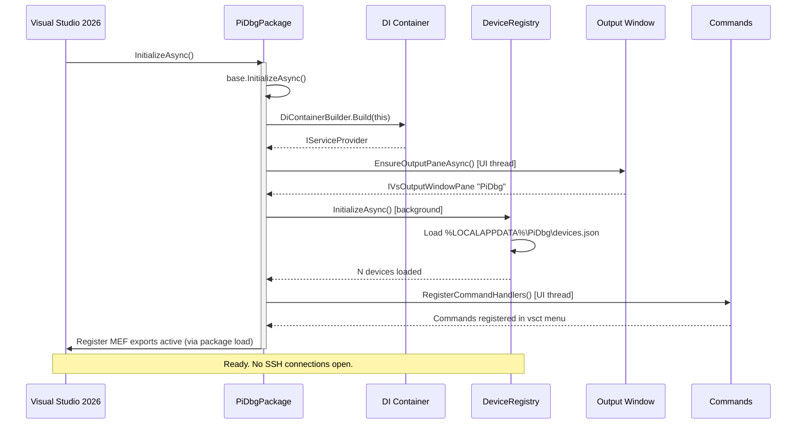
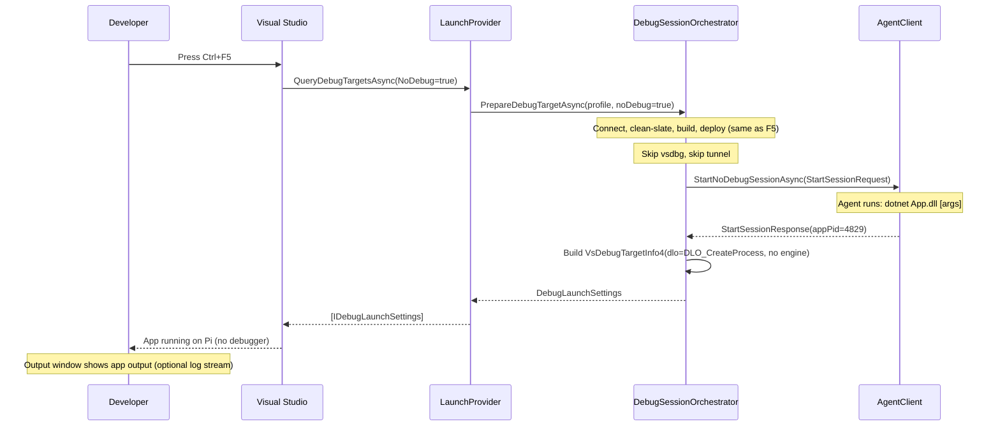
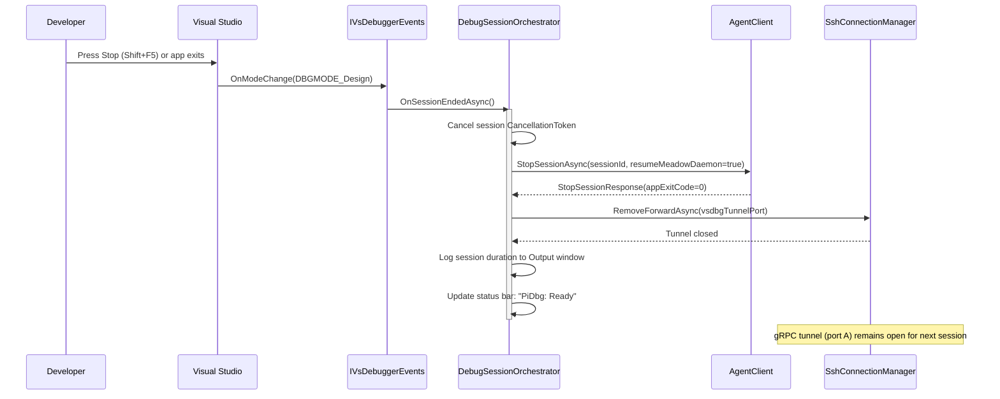
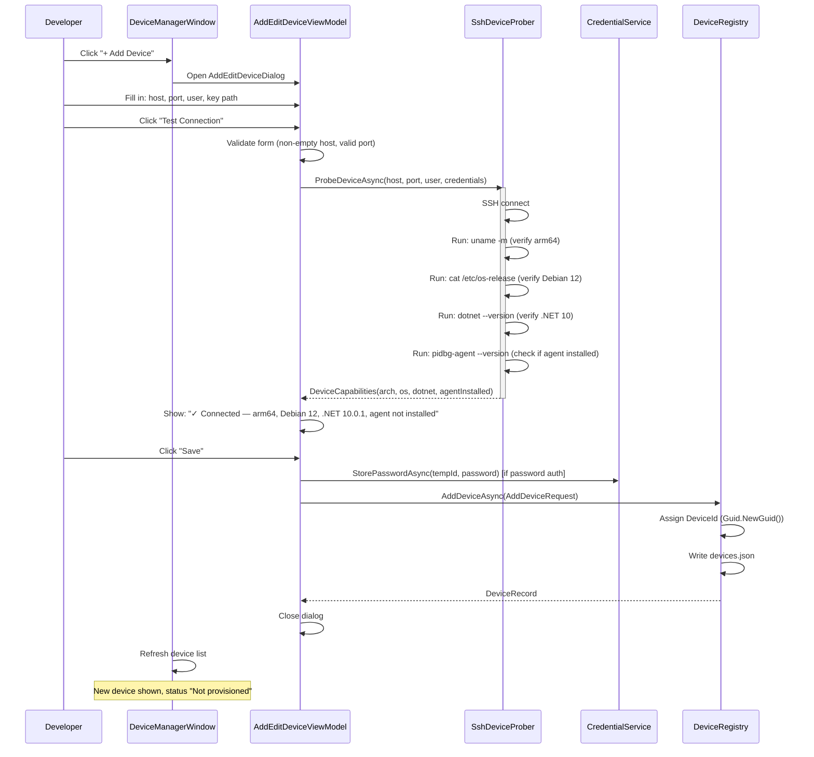
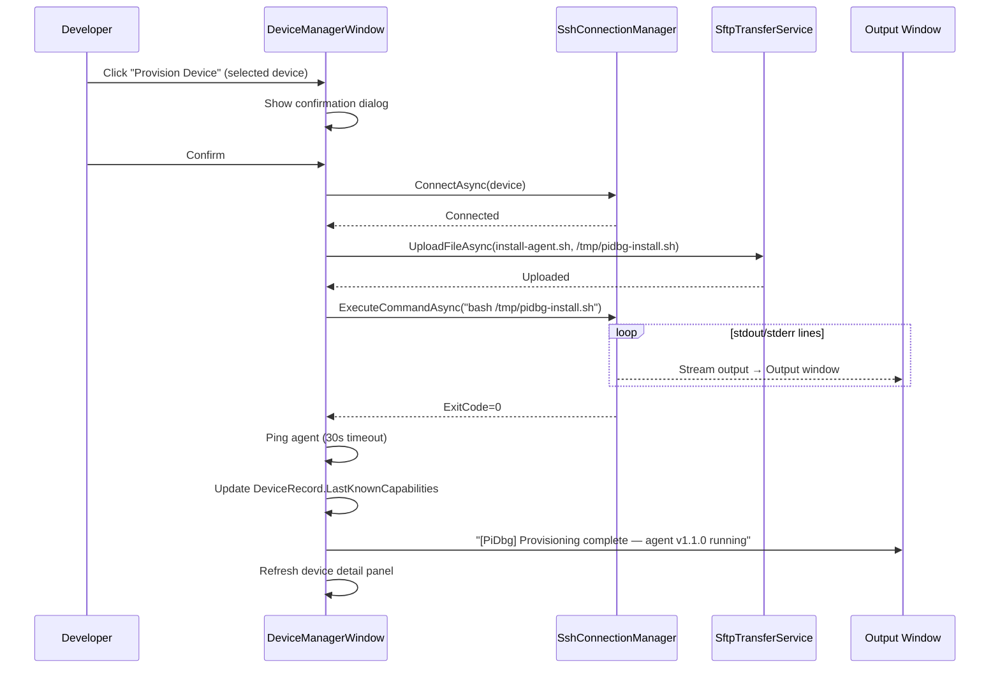
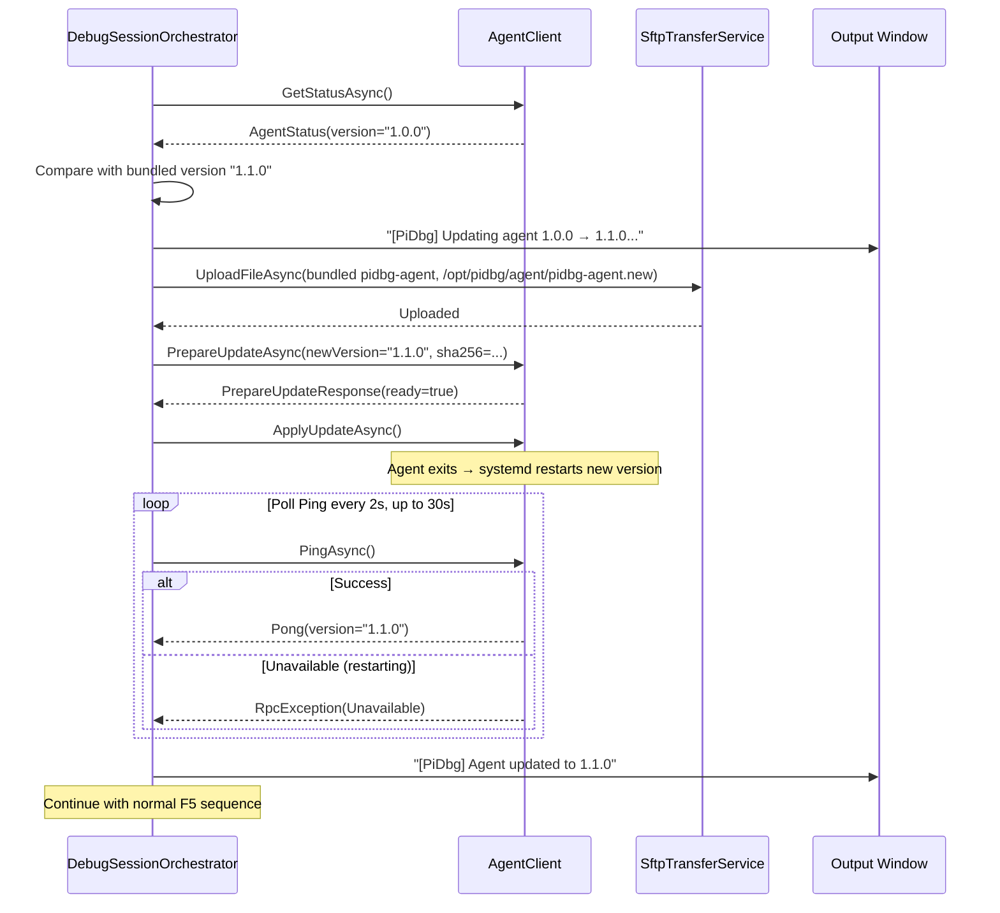

# PiDbg VSIX — Sequence Diagrams

---

## 1. Extension Load → Ready



---

## 2. F5 — Full Debug Session (first run)

```mermaid
sequenceDiagram
    participant Dev as Developer
    participant VS as Visual Studio
    participant LP as LaunchProvider
    participant DSO as DebugSessionOrchestrator
    participant Build as VsBuildService
    participant Conn as DeviceConnectionFactory
    participant SSH as SshConnectionManager
    participant AC as AgentClient (gRPC)
    participant SFTP as SftpTransferService
    participant Dbg as VS Debugger Engine

    Dev->>VS: Press F5
    VS->>LP: QueryDebugTargetsAsync()
    LP->>LP: Read active RaspberryPiLaunchProfile
    LP->>DSO: PrepareDebugTargetAsync(profile, noDebug=false)
    activate DSO

    Note over DSO: Switch to background thread

    DSO->>Conn: GetOrCreateConnectionAsync(deviceId)
    Conn->>SSH: ConnectAsync(SshConnectionOptions)
    SSH->>SSH: TCP connect → SSH handshake → auth
    SSH-->>Conn: Connected
    Conn->>Conn: Open ForwardedPortLocal (gRPC tunnel: localA → Pi:50051)
    Conn->>AC: Create GrpcChannel(http://localhost:localA)
    Conn-->>DSO: IDeviceConnection

    DSO->>AC: PingAsync()
    AC-->>DSO: Pong (agent v1.1.0)

    DSO->>AC: GetVsdbgInfoAsync()
    AC-->>DSO: VsdbgInfo(installed=true, v17.x)

    Note over DSO: Clean-slate (§ doc-10)
    DSO->>AC: StartSession → agent kills stale processes first

    DSO->>Build: BuildAndPublishAsync(project, "Debug", "linux-arm64")
    Build->>VS: IBuildManager.BuildAsync(target=Publish)
    VS-->>Build: Build succeeded, publish dir ready
    Build-->>DSO: PublishResult(dir, fileCount, totalBytes)

    DSO->>AC: BeginDeploymentAsync(appName, fileCount, totalBytes)
    AC-->>DSO: DeploymentInfo(deploymentId, stagingPath)

    loop For each file
        DSO->>SFTP: UploadFileAsync(localFile, remoteStagingFile)
        SFTP-->>DSO: Progress
    end

    DSO->>AC: CommitDeploymentAsync(deploymentId, manifest)
    AC-->>DSO: CommitResponse(success=true)

    DSO->>SSH: AddLocalForwardAsync(remotePort=4024)
    SSH-->>DSO: ForwardedPort(localPort=B)

    DSO->>AC: StartDebugSessionAsync(StartSessionRequest)
    AC-->>DSO: StartSessionResponse(sessionId, vsdbgPort=4024, vsdbgPid=4823)

    DSO->>DSO: Build VsDebugTargetInfo4(bstrOptions="transport=tcp;host=127.0.0.1;port=B")
    DSO-->>LP: DebugLaunchSettings

    deactivate DSO
    LP-->>VS: [IDebugLaunchSettings]

    VS->>Dbg: LaunchDebugTargets4(VsDebugTargetInfo4)
    Dbg->>Dbg: Connect to localhost:B (tunneled to Pi:4024)
    Dbg-->>VS: Debugger attached
    VS-->>Dev: Breakpoints active, debugging
```

---

## 3. Ctrl+F5 — Run Without Debugging



---

## 4. Stop Debug Session



---

## 5. Add Device Flow



---

## 6. Provision Device Flow



---

## 7. Agent Auto-Update Flow


