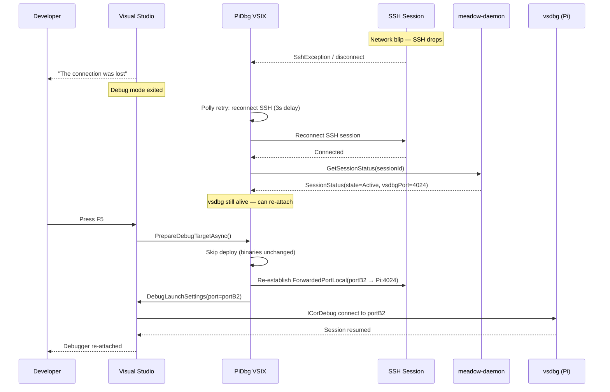

# PiDbg VSIX — Debugger Integration Layer

Covers the full design of how Visual Studio 2026 communicates with vsdbg on a remote
Raspberry Pi ARM64, including transport architecture, protocol selection, symbol
handling, lifecycle synchronization, and failure mode analysis.

---

## 1. How Visual Studio Talks to vsdbg

### 1.1 The Protocol Stack

Visual Studio's managed .NET debugger does **not** use the Debug Adapter Protocol (DAP).
DAP is the JSON-based protocol used by VS Code (and VS Code only). Visual Studio uses
its own internal binary protocol — Microsoft's **ICorDebug remoting protocol** — which
vsdbg implements when run in server mode.

The full stack from developer to debugged process:

```
┌──────────────────────────────────────────────────────────────────────────────┐
│  Developer Machine                                                            │
│                                                                               │
│  Visual Studio 2026                                                           │
│  ┌─────────────────────────────────────────────────────────────────────────┐ │
│  │  Debugger UI (breakpoints, watch, locals, call stack, threads)          │ │
│  │  ↕  VS Debug API surface (IVsDebugger4, IDebugEventCallback2, ...)      │ │
│  │                                                                          │ │
│  │  Managed Debug Engine  {2E36F1D4-B23C-435D-AB41-18E608940038}           │ │
│  │  ↕  ICorDebug remoting protocol  (Microsoft-private binary over TCP)    │ │
│  └──────────────────────────────────────┬───────────────────────────────────┘ │
│                                          │ TCP  localhost:{portB}              │
│  ┌───────────────────────────────────────▼───────────────────────────────────┐ │
│  │  SSH.NET ForwardedPortLocal  localhost:{portB} ──→ Pi:4024                │ │
│  └───────────────────────────────────────────────────────────────────────────┘ │
└──────────────────────────────────────────────────────────────────────────────┘
                                SSH encrypted channel
┌──────────────────────────────────────────────────────────────────────────────┐
│  Raspberry Pi ARM64                                                            │
│                                                                               │
│  vsdbg  (127.0.0.1:4024)                                                      │
│  ┌─────────────────────────────────────────────────────────────────────────┐ │
│  │  ICorDebug remoting server                                               │ │
│  │  ↕  .NET Diagnostics API  (EventPipe / IPC)                             │ │
│  └──────────────────────────────────────┬───────────────────────────────────┘ │
│                                          │ local IPC                           │
│  ┌───────────────────────────────────────▼───────────────────────────────────┐ │
│  │  .NET 10 Managed App  (dotnet MyApp.dll)                                  │ │
│  │  CoreCLR diagnostic server  (/tmp/dotnet-diagnostic-{pid}-*)              │ │
│  └─────────────────────────────────────────────────────────────────────────┘ │
└──────────────────────────────────────────────────────────────────────────────┘
```

### 1.2 The Two vsdbg Modes

vsdbg supports two distinct protocol modes:

| Mode | Flag | Protocol | Consumer |
|---|---|---|---|
| Server mode | `--server --port N` | ICorDebug remoting (MS-private) | **Visual Studio** |
| Stdio/DAP mode | `--interpreter=vscode` | Debug Adapter Protocol (JSON) | VS Code, CLI tools |

**We use server mode exclusively.** Stdio/DAP mode is for VS Code; it requires a DAP
client, not the VS managed debug engine.

When vsdbg is launched with `--server --port 4024`, it:
1. Binds TCP on `127.0.0.1:4024`
2. Waits for exactly one VS managed engine connection
3. Performs the ICorDebug protocol handshake
4. Attaches to (or launches) the target process via CoreCLR's diagnostic APIs
5. Becomes the bridge between VS debug engine and the live .NET runtime

### 1.3 MIEngine — What It Is and Why It Does Not Apply

MIEngine (`{EA6637C6-17DF-45B5-A183-0951C54243BC}`) is VS's Machine Interface debug
engine, designed for C/C++ debugging via GDB or LLDB using the MI text protocol.
It is **not involved in managed .NET debugging in any way**. References to MIEngine in
the context of .NET remote debugging are a common misconception. Our system uses only
the managed debug engine `{2E36F1D4-B23C-435D-AB41-18E608940038}`.

### 1.4 Whether to Use DAP Directly

**No.** The VS managed debug engine does not speak DAP. Using DAP would require
implementing a custom debug engine — exactly what the constraints prohibit.

DAP is the right protocol for VS Code extensions and standalone CLI tools. For Visual
Studio, the managed engine and vsdbg in server mode are the correct pair and should
be used as-is. We do not wrap, translate, or proxy the protocol.

---

## 2. Transport Architecture

### 2.1 Chosen Architecture: SSH Tunnel + Direct TCP

```
VSIX (VSIX-side control plane)
    │
    │  gRPC (SSH tunnel A → Pi:50051)
    │  Call: StartDebugSession → returns vsdbgPort=4024
    │
    │  SSH ForwardedPortLocal
    │  portB (random local) ←────────────SSH──────────────→ Pi:4024
    │
VS Managed Debug Engine
    │
    └── TCP connect to localhost:portB
        (transparently tunneled to vsdbg on Pi)
```

The debug protocol is **transparent to the VSIX**. Once the SSH tunnel is established,
the VSIX hands `localhost:portB` to the VS debug engine and steps aside. All ICorDebug
protocol bytes flow directly: VS engine → SSH.NET tunnel → vsdbg. No VSIX code is in
the debug protocol path.

### 2.2 Transport Alternatives Considered

#### Option B: Daemon gRPC Proxy

```
VS engine → SSH tunnel → Pi:50051 (daemon) → Pi:4024 (vsdbg)
                                ↑
                         daemon proxies TCP
```

**Rejected.** The daemon would need to buffer an opaque binary protocol it has no
knowledge of. Every debug operation (step, eval, breakpoint hit) would pass through
an extra TCP hop. Adds latency, complexity, and a new failure point with zero benefit.
The daemon's job is to *start* vsdbg, not to *be* vsdbg.

#### Option C: vsdbg stdio over SSH exec

```
VS engine → custom ITransport → SSH exec "vsdbg --interpreter=vscode" → vsdbg stdio
```

**Rejected.** This requires implementing a custom `ITransport` for VS's debug engine
to consume DAP from stdio. Requires significant VS SDK depth and effectively builds a
custom debugger transport — prohibited by constraints. Also ties the debug connection
lifetime to a specific SSH channel.

#### Option D: Direct TCP (no SSH)

```
VS engine → TCP → Pi:4024 (vsdbg bound on 0.0.0.0)
```

**Rejected.** Requires vsdbg to bind a public port. Adds firewall configuration.
Removes authentication (any process on the network can connect to vsdbg). SSH tunneling
provides auth, encryption, and port isolation at zero additional implementation cost.

### 2.3 Transport Diagram — Full Detail

```
Developer Machine                              Raspberry Pi
─────────────────────────────────────          ─────────────────────────────────
                                               meadow-daemon
  PiDbg VSIX ──────gRPC tunnel A──────────────► StartDebugSession()
                                               │  vsdbg spawned on port 4024
                                               │  returns sessionId, vsdbgPort=4024
  VSIX: add SSH ForwardedPortLocal             │
  local:portB ─────SSH tunnel B────────────────────────────────────► vsdbg:4024
                                               │
  VSIX: build VsDebugTargetInfo4              │
  bstrOptions host=127.0.0.1 port=portB       │
  ↓                                           │
  VS LaunchDebugTargets4()                    │
  ↓                                           │
  Managed debug engine                        │
  TCP connect → 127.0.0.1:portB              │
       ─ ─ ─ ─ ─ ─ (SSH tunnel B) ─ ─ ─ ─ ─►vsdbg accepts connection
       ─ ─ ─ ─ ─ ─ ICorDebug handshake  ─ ─ ─►
       ◄─ ─ ─ ─ ─ ─ ready  ─ ─ ─ ─ ─ ─ ─ ─ ─
                                               vsdbg ←IPC→ .NET 10 app
  VS: debugger attached
  Developer: breakpoints active
```

Two independent SSH tunnels run simultaneously:
- **Tunnel A** (gRPC): `localhost:portA` → `Pi:50051` — control plane (VSIX lifetime)
- **Tunnel B** (vsdbg): `localhost:portB` → `Pi:4024` — debug protocol (session lifetime)

Tunnel A persists for the entire VS session. Tunnel B is created when a debug session
starts and removed when it ends.

---

## 3. vsdbg Startup Model

### 3.1 Daemon-Side vsdbg Management

The daemon owns vsdbg completely. The VSIX never interacts with vsdbg directly except
through the SSH tunnel it creates.

```
VSIX calls StartDebugSession(appName, mode, vsdbgVersion, correlationId)
  │
  ├── Daemon: EnsureVsdbgAsync(vsdbgVersion)
  │     If not installed or wrong version:
  │       Download via GetVsDbg.sh (or install from pre-uploaded tarball)
  │       Wait for completion (this can take 20-60s; progress logged)
  │
  ├── Daemon: SelectPortAsync(rangeStart=4024, rangeEnd=4124)
  │     Find lowest port in range not bound by another session
  │
  ├── Daemon: Spawn vsdbg process
  │     Mode=Launch:  vsdbg --server --port 4024
  │     Mode=Attach:  vsdbg --server --port 4024 --attach {appPid}
  │
  ├── Daemon: WaitForPortAsync(4024, timeout=10s)
  │     Poll /proc/net/tcp6 every 250ms for LISTEN state
  │
  └── Daemon: Return StartDebugSessionResponse(sessionId, vsdbgPid, vsdbgPort)
```

### 3.2 vsdbg Launch Arguments

#### Attach mode (app already running, vsdbg attaches to it)

```
vsdbg --server --port 4024 --attach {appPid}
```

vsdbg attaches to the running .NET process. The app continues from wherever it was
(if paused) or runs normally until a breakpoint is hit.

#### Launch mode (vsdbg starts the app itself)

```
vsdbg --server --port 4024
```

The launch parameters (entry point, args, working dir, environment) are sent by the
VS debug engine as part of the ICorDebug protocol handshake, not via command-line args
to vsdbg. vsdbg reads them from VS and starts the process itself.

**For our scenario**: We always use **Attach mode**. The workflow is:
1. Deploy debug build → daemon commits to `debug/` slot
2. Start app → daemon runs `dotnet MyApp.dll` from `debug/` dir
3. App is running; vsdbg attaches to its PID
4. Developer sees breakpoints activate

This is superior to Launch mode because:
- The app's startup code runs normally (no "waiting for debugger" delays)
- App process lifetime is managed by the daemon, not vsdbg
- vsdbg death doesn't kill the app (important for reconnect)

### 3.3 Why Attach over Launch

If vsdbg is in Launch mode, the app process is a child of vsdbg. When vsdbg exits
(intentionally or by crash), the app also dies — or is orphaned with a broken parent.
In Attach mode, vsdbg and the app are independent processes, both supervised by the
daemon.

The tradeoff: breakpoints set in `Main()` or module constructors cannot be hit in
Attach mode if they execute before vsdbg attaches. For the typical debug scenario
(developer sets breakpoints in business logic, not startup code), Attach is correct.

If a developer needs to break on startup (`Debugger.Launch()` or `-Wait` startup), the
daemon should support a **wait-for-debugger mode**: start the app, it blocks on
`Debugger.Launch()`, then vsdbg attaches while the app is suspended at that point.

---

## 4. Launch Configuration Generation

### 4.1 VsDebugTargetInfo4 Construction

The VSIX's `RaspberryPiLaunchProvider.PrepareDebugTargetAsync` returns a
`DebugLaunchSettings` that VS translates into a `VsDebugTargetInfo4`:

```
VsDebugTargetInfo4
├── dlo                  = DLO_AlreadyRunning
│     vsdbg is already running; VS should connect, not launch
├── guidLaunchDebugEngine = {2E36F1D4-B23C-435D-AB41-18E608940038}
│     The .NET managed debug engine GUID — stable since VS 2019
├── bstrExe              = "/opt/meadow/apps/MyApp/debug/MyApp.dll"
│     Remote path of the app binary (for process identification)
├── bstrRemoteMachine    = ""
│     Empty — we handle the remote transport ourselves via tunnel
├── bstrOptions          = <see §4.2>
├── dwClsidCount         = 1
└── pClsidList           = [ {2E36F1D4-B23C-435D-AB41-18E608940038} ]
```

### 4.2 bstrOptions Format

The managed debug engine accepts `bstrOptions` as a JSON object with the following
structure for remote TCP connections:

```json
{
  "version": "0.2.0",
  "adapter": "__default__",
  "adapterArgs": "--server --port {localTunnelPort}",
  "languageMappings": {
    "C#": {
      "languageId": "3F5162F8-07C6-11D3-9053-00C04FA302A1",
      "extensions": [ "*" ]
    }
  },
  "exceptionCategoryMappings": {
    "CLR": "449EC4CC-30D2-4032-9256-EE18EB41B62B",
    "MDA": "6ECE07A9-0EDE-45C4-8296-818D8FC401D4"
  },
  "sourceFileMap": {
    "/opt/meadow/apps/MyApp/debug/": "${workspaceFolder}/"
  }
}
```

**Important caveat**: The exact `bstrOptions` JSON schema is validated by the VS
managed debug engine at runtime. The format above is the documented schema for VS
2022+ .NET remote debugging. It must be tested against the actual VS 2026 SDK. The
VSIX should catch `COMException` from `IVsDebugger4.LaunchDebugTargets4` and surface
a clear error if the format is rejected.

Alternative `bstrOptions` format (semicolon key=value, older engines):
```
transport=tcp;host=127.0.0.1;port={localTunnelPort}
```

The implementation should try JSON first and fall back to the legacy format on failure.

### 4.3 DebugLaunchSettings Construction

```csharp
internal static DebugLaunchSettings BuildDebugLaunchSettings(
    int localTunnelPort,
    RaspberryPiLaunchProfile profile,
    string remoteAppPath,
    string localSourceRoot)
{
    var options = new
    {
        version = "0.2.0",
        adapter = "__default__",
        adapterArgs = $"--server --port {localTunnelPort}",
        languageMappings = new
        {
            CSharp = new
            {
                languageId = "3F5162F8-07C6-11D3-9053-00C04FA302A1",
                extensions = new[] { "*" }
            }
        },
        exceptionCategoryMappings = new Dictionary<string, string>
        {
            ["CLR"] = "449EC4CC-30D2-4032-9256-EE18EB41B62B",
            ["MDA"] = "6ECE07A9-0EDE-45C4-8296-818D8FC401D4"
        },
        sourceFileMap = new Dictionary<string, string>
        {
            [remoteAppPath.TrimEnd('/') + "/"] = localSourceRoot.TrimEnd('\\') + "\\"
        }
    };

    return new DebugLaunchSettings(profile.LaunchOptions)
    {
        LaunchOperation = DebugLaunchOperation.AlreadyRunning,
        LaunchDebugEngineGuid = new Guid("2E36F1D4-B23C-435D-AB41-18E608940038"),
        Executable = $"{remoteAppPath}/{profile.EntryPoint}",
        Options = JsonSerializer.Serialize(options),
    };
}
```

---

## 5. SSH Transport — Detailed Design

### 5.1 Why SSH Tunneling Wins

| Property | SSH Tunnel | Direct TCP | stdio over SSH |
|---|---|---|---|
| Authentication | SSH key (already required) | None | SSH key |
| Encryption | Yes (SSH) | None | Yes (SSH) |
| Firewall config | None (piggybacks port 22) | Requires open port | None |
| vsdbg binds | 127.0.0.1 only | 0.0.0.0 | N/A (stdio) |
| Implementation complexity | Low (SSH.NET `ForwardedPortLocal`) | Medium | High (custom transport) |
| Reconnect support | Yes (new tunnel, same vsdbg port) | Yes (reconnect TCP) | No (tied to exec channel) |
| Multiple sessions | Yes (one tunnel per session) | Yes | Hard |

### 5.2 SSH.NET Tunnel Lifecycle

```csharp
// In DebugSessionOrchestrator, after receiving vsdbgPort from StartDebugSession:

// portB is a randomly assigned local port
var tunnel = new ForwardedPortLocal("127.0.0.1", 0, "127.0.0.1", (uint)vsdbgPort);
_sshClient.AddForwardedPort(tunnel);
tunnel.Start();
var localTunnelPort = (int)tunnel.BoundPort; // OS-assigned
_activeTunnels[sessionId] = tunnel;

// Hand localTunnelPort to VS debug engine
var settings = BuildDebugLaunchSettings(localTunnelPort, ...);
```

`ForwardedPortLocal` with `localPort=0` lets the OS assign a free port. This avoids
port collisions when multiple debug sessions run (multiple apps, rare but valid).

### 5.3 Tunnel Keepalive

SSH connections can silently drop (NAT timeout, sleep/wake, Wi-Fi roam). The gRPC
keep-alive (ping every 30s on the control tunnel) maintains the SSH session, but the
vsdbg tunnel is a separate `ForwardedPortLocal` channel inside the same SSH session.

If the SSH session drops:
- Both tunnels go dead simultaneously
- VS debug engine loses TCP connection to vsdbg → debug session fails in VS
- VSIX heartbeat (`GetSessionStatus` every 30s) detects dead session on next tick
- VSIX reconnects SSH session, re-establishes gRPC tunnel
- vsdbg is still alive on Pi (daemon hasn't killed it)
- See §9 for reconnect handling

SSH session keepalive configuration:
```csharp
var connectionInfo = new ConnectionInfo(host, port, username, authMethods)
{
    Timeout = TimeSpan.FromSeconds(30),
};
// On SshClient after connect:
_sshClient.KeepAliveInterval = TimeSpan.FromSeconds(15);
```

---

## 6. Symbol Handling

### 6.1 Symbol Deployment

PDB files are **deployed to the Pi alongside the DLL**. No separate symbol server is
used for development debugging scenarios.

The deployment pipeline:
1. Build: `dotnet publish -c Debug -r linux-arm64 --no-self-contained`
2. Output contains: `MyApp.dll`, `MyApp.pdb`, dependencies, `*.pdb` files
3. VSIX deploys entire publish directory to Pi debug slot
4. vsdbg reads `MyApp.pdb` from the same directory as `MyApp.dll`

The PDB file contains:
- Method IL offset → source file + line number mappings
- Local variable names and scopes
- Type definitions and their source locations
- Per-file checksums (SHA-256 or MD5)

### 6.2 PDB Requirements

PDBs must be **portable PDBs** (the default for .NET 5+):

```xml
<!-- In the app's .csproj — already the default, explicitly stated for clarity -->
<PropertyGroup>
  <DebugType>portable</DebugType>
  <DebugSymbols>true</DebugSymbols>
  <!-- Embed source into PDB for maximum reliability -->
  <EmbedAllSources>true</EmbedAllSources>
</PropertyGroup>
```

`EmbedAllSources` embeds source file content directly in the PDB. This eliminates all
source mapping and checksum validation failures — vsdbg serves the source directly from
the PDB without needing the local file. For development debugging, this is the
recommended configuration.

Without `EmbedAllSources`, vsdbg resolves source by path from the PDB and VS must find
the file at that local path. This works automatically when building and debugging from
the same machine.

### 6.3 Symbol Resolution Flow

```
Breakpoint hit at IL offset 0x24 in MyApp.MyService.ProcessAsync
    │
    vsdbg: read PDB → IL 0x24 → Program.cs line 47
    │
    vsdbg: send source reference to VS managed engine
    │     { file: "C:\\Users\\dev\\projects\\MyApp\\src\\Program.cs", line: 47 }
    │     OR (if EmbedAllSources): embedded source content directly
    │
    VS managed engine:
    ├── If embedded: open virtual document from PDB content
    └── If file path: locate file on dev machine
          ├── Try direct path → found → open
          ├── Try sourceFileMap → remap path → try again
          └── Not found → prompt developer for location
```

---

## 7. Source Mapping

### 7.1 When Mapping Is Needed

Source mapping is required only when the build machine paths in the PDB do not match
the current source file locations. Common cases:

| Scenario | Needs mapping |
|---|---|
| Dev builds and debugs on same machine, same path | No |
| Dev has moved the solution to a different folder | Yes |
| CI-built symbols, debugging locally | Yes |
| `EmbedAllSources = true` | Never (no path lookup) |

### 7.2 sourceFileMap in bstrOptions

The `sourceFileMap` in `bstrOptions` maps remote/build paths to local paths:

```json
{
  "sourceFileMap": {
    "/home/ci/build/MyApp/": "C:\\Users\\dev\\projects\\MyApp\\",
    "/opt/meadow/apps/MyApp/debug/": "C:\\Users\\dev\\projects\\MyApp\\publish\\"
  }
}
```

The keys are path prefixes (case-sensitive on Linux); values are the local replacements.

### 7.3 Automatic Path Mapping

The VSIX should attempt automatic mapping generation:
1. Read the active project's directory from the VS project system
2. Compare with the remote deploy path in the launch profile
3. If PDB embedded paths begin with the project root, no mapping is needed
4. If PDB paths are CI-style (e.g., `/home/runner/work/`), generate a mapping entry

For the common case (dev builds locally), no mapping configuration is needed.

---

## 8. Checksum Validation

### 8.1 What It Is

Portable PDBs include a SHA-256 (or MD5) checksum of each source file at build time.
When vsdbg maps a stack frame to a source file, it computes the checksum of the local
file and compares it to the PDB entry. Mismatch → VS shows "Source may not match the
current version."

### 8.2 Ensuring Clean Checksums

For the debug deployment flow, checksums are always clean because:
1. Developer edits source
2. `dotnet publish` rebuilds — new DLL + new PDB with matching checksums
3. VSIX deploys both to Pi
4. vsdbg uses the deployed PDB

The only way checksums can mismatch is if the developer modifies source *after* the
last build but before a new deployment. VS shows the warning and still allows debugging
with a yellow "source may not match" indicator.

`EmbedAllSources = true` makes checksum validation moot — vsdbg serves the embedded
source directly from the PDB, which is always internally consistent.

### 8.3 VSIX Checksum Verification

The VSIX already verifies manifest SHA-256 during deployment (`ManifestVerifier`). This
ensures the deployed binaries are not corrupted in transit. This is separate from the
PDB source checksum — the manifest check verifies file integrity at transfer time; the
PDB checksum verifies source/binary consistency at debug time.

---

## 9. Reconnect Handling

### 9.1 What "Reconnect" Means in Practice

True transparent reconnect — where VS resumes a debug session after an SSH drop without
developer action — is **not achievable** with the VS managed debug engine. When VS
loses the TCP connection to vsdbg, the debug engine marks the session as failed and VS
exits debug mode. There is no VS API to re-attach to an existing debug session from a
failed state.

What IS achievable: **fast re-start** — the developer presses F5 again after a
disconnect, and the new session starts quickly because:
1. vsdbg may still be alive (daemon's 30-min orphan timeout)
2. The app may still be running (if vsdbg detached cleanly)
3. Deploy step can be skipped if binaries are unchanged (future delta-deploy feature)

### 9.2 Session Survival During Transient Network Blip

If the SSH session drops and reconnects within ~30 seconds:
1. vsdbg is still alive on Pi (daemon has not killed it)
2. App may still be running (vsdbg detach-on-disconnect behavior)
3. VSIX re-establishes SSH session automatically via Polly retry
4. New gRPC tunnel A is established (Kestrel reconnects)
5. VSIX calls `GetSessionStatus(sessionId)` → session still `Active`
6. VSIX re-establishes vsdbg tunnel B to the same port
7. **BUT**: VS debug engine has already exited debug mode — developer must press F5 again
8. New `LaunchDebugTargets4` → VS engine connects to the still-running vsdbg → debugging resumes

From the developer's perspective: network blip → VS shows "Connection lost" → press F5
→ debugger re-attaches within ~3 seconds (no redeploy needed).

### 9.3 Reconnect Sequence



### 9.4 Daemon Orphan Timeout

vsdbg is killed by the daemon if no gRPC activity is seen for 30 minutes
(`DebugSessionOrphanTimeoutMinutes`). The VSIX sends a heartbeat (`GetSessionStatus`)
every 30 seconds during an active session to keep this timer alive.

---

## 10. Debugger Lifecycle

### 10.1 Full Lifecycle State Machine

```
┌─────────────┐
│   Idle      │  ← Developer has not pressed F5
└──────┬──────┘
       │ F5 pressed
       ▼
┌─────────────┐
│  Building   │  dotnet publish
└──────┬──────┘
       │ Build succeeded
       ▼
┌─────────────┐
│  Deploying  │  SFTP upload to staging, CommitDeployment
└──────┬──────┘
       │ Deploy committed
       ▼
┌─────────────────┐
│ Starting App    │  StopApplication (if running), StartApplication(debug slot)
└──────┬──────────┘
       │ App running (pid known)
       ▼
┌─────────────────┐
│ Starting vsdbg  │  StartDebugSession → vsdbg --server --port 4024 --attach {pid}
└──────┬──────────┘
       │ vsdbg bound on 4024
       ▼
┌─────────────────┐
│ Establishing    │  SSH ForwardedPortLocal(portB → Pi:4024)
│ Tunnel          │
└──────┬──────────┘
       │ Tunnel live
       ▼
┌─────────────────┐
│ Attaching       │  LaunchDebugTargets4 → VS managed engine → vsdbg handshake
└──────┬──────────┘
       │ Handshake complete
       ▼
┌─────────────────────────────────────────────────────────────────┐
│                       DEBUGGING                                  │
│  Breakpoints / Stepping / Watch / Locals / Threads / Exceptions │
└──────┬──────────────────────────────────────────────────────────┘
       │ Shift+F5 / App exits / Crash / Disconnect
       ▼
┌─────────────────┐
│  Stopping       │  StopDebugSession → kill vsdbg → remove tunnel
└──────┬──────────┘
       │ Cleanup complete
       ▼
┌─────────────────┐
│  Post-Debug     │  If resumeMeadowDaemon: restart app (production slot)
└─────────────────┘
```

### 10.2 What VS Debugging Features Require

| Feature | Required on VSIX side | Required from vsdbg |
|---|---|---|
| Breakpoints | Set before attach via `VsDebugTargetInfo4.pDebugTargets` or post-attach via engine | Full support |
| Step over/into/out | Nothing extra | Full support |
| Watch expressions | Nothing extra | Full support |
| Locals | Nothing extra | Full support |
| Call stacks | Nothing extra | Full support |
| Async (`await`) debugging | Build with `<Optimize>false</Optimize>` | Full support |
| Exception settings | Pass exception category mappings in `bstrOptions` | Full support |
| Threads | Nothing extra | Full support |
| Tasks (TPL) | Nothing extra | Full support |
| Edit and Continue | **Not supported** (remote ARM64) | Not available |
| Hot Reload | **Not supported** (remote) | Not available |

The Debug build configuration (`-c Debug`) automatically disables optimizations,
which is required for accurate locals display and async state machine debugging.

---

## 11. Process Lifecycle Synchronization

### 11.1 The Three-Process Problem

Three processes must stay synchronized:

```
┌──────────────────┐     ┌──────────────────┐     ┌──────────────────┐
│  VS Debug Engine │     │     vsdbg         │     │  Managed App     │
│  (dev machine)   │     │  (Pi pid:4823)   │     │  (Pi pid:4829)  │
└────────┬─────────┘     └────────┬──────────┘     └────────┬─────────┘
         │ ICorDebug protocol     │ IPC/diagnostic          │
         └────────────────────────┘─────────────────────────┘
              (vsdbg bridges VS engine to app runtime)
```

Death of any one process cascades:

| What dies | Effect |
|---|---|
| Managed app exits | vsdbg detects exit, notifies VS engine, VS exits debug mode |
| vsdbg exits | VS engine loses connection, exits debug mode; app continues |
| VS exits | VS engine disconnects from vsdbg; vsdbg may detach from app |

### 11.2 App Exit During Debugging

Normal path (app calls `Environment.Exit` or returns from `Main`):
1. .NET runtime notifies vsdbg via EventPipe
2. vsdbg sends `ProcessExited` notification to VS engine
3. VS engine sends `Stopped` event (reason: "exit") to VS UI
4. VS exits debug mode gracefully
5. VS raises `OnModeChange(DBGMODE_Design)`
6. VSIX receives event, calls `StopDebugSessionAsync(resumeMeadowDaemon)`
7. Daemon kills vsdbg (already detached but may still be running), removes tunnel

### 11.3 App Crash During Debugging

Unhandled exception path:
1. CLR catches unhandled exception
2. vsdbg receives "first-chance" then "second-chance" exception notification
3. VS shows the exception dialog (same as local debugging)
4. Developer can inspect stack/locals at crash point
5. Developer clicks "Continue" → app terminates (second-chance exception always fatal)
6. Sequence follows §11.2 from step 3

SIGSEGV/SIGKILL (native crash, OOM kill):
1. Process dies without .NET exception
2. vsdbg loses the IPC connection to the process
3. vsdbg notifies VS: process died unexpectedly
4. VS shows "Process has exited" in output window
5. Sequence follows §11.2 from step 4

### 11.4 VSIX Process Monitoring Heartbeat

The VSIX sends `GetSessionStatus(sessionId)` every 30 seconds. If the response
shows `state != Active` or an RPC error occurs, the VSIX initiates cleanup:

```csharp
// In DebugSessionOrchestrator background task:
using var timer = new PeriodicTimer(TimeSpan.FromSeconds(30));
while (await timer.WaitForNextTickAsync(_sessionCt))
{
    try
    {
        var status = await _agentClient.GetSessionStatusAsync(
            _activeSessionId, _sessionCt);

        if (!status.Found || status.Status.State != SessionState.Active)
        {
            _log.LogWarning("Session {Id} ended remotely — cleaning up", _activeSessionId);
            await CleanupSessionAsync();
            break;
        }
    }
    catch (RpcException ex) when (ex.StatusCode == StatusCode.Unavailable)
    {
        // SSH/gRPC tunnel dropped — handled by reconnect logic
    }
}
```

---

## 12. Stop and Disconnect Behavior

### 12.1 Normal Stop (Shift+F5)

```
Developer: Shift+F5
    │
    VS: IVsDebugger raises DBGMODE_Design
    │
    VSIX: OnModeChange handler fires
    │
    VSIX: StopDebugSessionAsync(sessionId, resumeMeadowDaemon=profile.ResumeMeadowDaemon)
    │       Daemon: SIGTERM vsdbg → 3s → SIGKILL
    │       Daemon: remove session record
    │       Daemon: if resumeMeadowDaemon → StartApplicationAsync(production slot)
    │
    VSIX: tunnel.Stop(); sshClient.RemoveForwardedPort(tunnel)
    │
    VSIX: update status bar "PiDbg: Ready"
```

### 12.2 VS Closes Without Stopping

`Package.Dispose()` fires:
1. VSIX cancels all session CancellationTokens
2. `DeviceConnectionFactory.CloseAllConnectionsAsync()` — for each active connection:
   a. `StopDebugSessionAsync` (if session active) — kills vsdbg
   b. SSH disconnect (sends SSH_MSG_DISCONNECT cleanly)
3. SSH close triggers vsdbg tunnel close → vsdbg loses VS connection
4. If vsdbg exits on disconnect (default behavior), daemon session record is cleaned up
   by the orphan checker on next 5s tick

### 12.3 Detach vs Stop

VS supports "Detach All" (debugger detaches but app keeps running). When the VS managed
engine detaches from vsdbg:
1. vsdbg sends "detach" command to the target process
2. App continues running normally
3. vsdbg may exit or remain listening (implementation-defined)
4. VSIX should call `StopDebugSessionAsync(resumeMeadowDaemon=false)` to clean up vsdbg
   if it hasn't exited, and leave the app running

---

## 13. Crash and Failure Handling

### 13.1 vsdbg Fails to Start

Failure point: `WaitForPortAsync` times out (10 seconds, no port in LISTEN state).

```
StartDebugSession returns error "vsdbg failed to bind port 4024 within 10s"
    │
    VSIX: log vsdbg stderr (streamed to output window during startup)
    VSIX: StopDebugSessionAsync (kills the process, clears session)
    VSIX: surface error in VS output window + InfoBar
    VSIX: suggest "Check vsdbg installation: Tools → PiDbg → Re-provision Device"
```

Common causes:
- vsdbg binary not executable (permissions)
- vsdbg version mismatch (wrong architecture, not ARM64)
- Port 4024 already in use by zombie vsdbg from previous session

### 13.2 vsdbg Crashes Mid-Session

vsdbg crashes after VS has attached:
1. TCP connection between VS engine and vsdbg drops
2. VS managed engine: connection lost → raises `DBGMODE_Design`
3. VSIX: `OnModeChange` fires, calls `StopDebugSessionAsync` as cleanup
4. VSIX: surface error in output window
5. Daemon: vsdbg `Process.Exited` event fires, removes session record

The app continues running (not a child of vsdbg in Attach mode).

### 13.3 App OOM Killed by Pi

The Pi's OOM killer may kill the managed app under memory pressure:
1. App dies with SIGKILL
2. vsdbg detects process exit (next IPC poll, within ~1s)
3. vsdbg sends "process exited" notification to VS engine
4. VS exits debug mode (shows "Process has exited" message)
5. Normal cleanup follows

### 13.4 SSH Tunnel Drop During Active Debug Session

1. `ForwardedPortLocal` raises `ExceptionRaised` event on tunnel B
2. VS engine: TCP connection to vsdbg → reads 0 bytes → connection closed
3. VS engine: debug session ends, DBGMODE_Design raised
4. VSIX: OnModeChange fires
5. VSIX: attempts SSH reconnect via Polly (3 retries, 2s backoff)
6. VSIX: if SSH reconnects within 30s, calls GetSessionStatus
7. If session still active on daemon side: surface "Reconnect" InfoBar option
8. Developer clicks "Reconnect" → VSIX re-runs the attach-only flow (no redeploy)

---

## 14. Timeout Handling

Complete timeout inventory:

| Timeout | Value | Action on expiry |
|---|---|---|
| SSH connect | 30s | Fail with "Cannot connect to Pi — check host/port/key" |
| gRPC Ping | 5s | Retry × 3, then fail session |
| vsdbg install | 120s | Fail, show installer log in output window |
| vsdbg port bind | 10s | Fail StartDebugSession, kill vsdbg process |
| Deploy file upload (per file) | 30s | Abort deployment |
| CommitDeployment (SHA-256 verify) | 60s | Abort deployment |
| Stop app graceful | config (5s default) → SIGKILL | Log forced kill |
| Stop vsdbg graceful | 3s → SIGKILL | Log forced kill |
| VS LaunchDebugTargets4 | VS controls (typically 30s) | VS shows "attach failed" |
| Session heartbeat interval | 30s | (normal polling interval) |
| Session orphan timeout | 30min | Daemon kills vsdbg, removes session |
| SSH reconnect Polly | 3 retries × 2s backoff | Fail, show "connection lost" InfoBar |

All VSIX-side timeouts use `CancellationTokenSource.CreateLinkedTokenSource` combining
the per-operation timeout with the session-level `CancellationToken`. When either fires,
the operation fails and cleanup begins.

---

## 15. Capability Negotiation

The ICorDebug protocol between VS managed engine and vsdbg includes a capability
negotiation phase during the initial handshake. This determines:
- Protocol version to use
- Which debugging features are available
- Exception category support
- Expression evaluator version

Since vsdbg is Microsoft's own debugger for Microsoft's own debug engine, capability
negotiation is handled entirely by vsdbg and the VS engine. **The VSIX does not
participate in capability negotiation** and should not attempt to do so.

The exception category mappings in `bstrOptions` (§4.2) are the only capability-related
input the VSIX provides, and only to configure which exception types are catchable by
VS's exception settings dialog.

---

## 16. Diagnostics Logging

### 16.1 What to Log and Where

| Event | Logged by | Destination |
|---|---|---|
| SSH connect / disconnect | VSIX `SshConnectionManager` | VS Output window (PiDbg pane) |
| vsdbg install progress | Daemon → gRPC StreamLogs → VSIX | VS Output window |
| vsdbg startup (stdout/stderr) | Daemon captures vsdbg stderr | VS Output window |
| Session start / stop | VSIX `DebugSessionOrchestrator` | VS Output window + file log |
| Transport errors | VSIX `SshConnectionManager` | VS Output window + InfoBar |
| ICorDebug protocol errors | VS managed engine | VS debug output pane |
| App stdout/stderr | Daemon → gRPC StreamOutput → VSIX | VS Output window (optional) |

### 16.2 vsdbg stderr Capture

The daemon captures vsdbg's stderr and routes it to the gRPC log stream, which the
VSIX shows in the output window. This is critical for diagnosing vsdbg startup failures.

In `VsdbgLauncher`:
```
psi.RedirectStandardError = true;
psi.RedirectStandardOutput = true;
// Pump stderr to _log as Warning messages (vsdbg startup diagnostics)
// Pump stdout to _log as Debug messages (vsdbg operational noise)
```

vsdbg emits its version and startup status to stderr on successful start:
```
Waiting for connection on port 4024 (vsdbg v17.x, runtime .NET 10.0.x)
```
This line is forwarded to the VSIX output window as confirmation.

### 16.3 Correlation IDs

Every F5 press generates an 8-character hex `correlationId` (VSIX-side). This ID is:
1. Passed in `StartDebugSession.correlation_id`
2. Stored in `DebugSessionRecord.CorrelationId` on the daemon
3. Included in all daemon log entries for the session
4. Included in all VSIX log entries via `LogContext.PushProperty`

To trace a complete debug session across both sides:
```
# VSIX log: grep correlationId = "a3b7c9f1"
# Pi journal: journalctl --user -u meadow-daemon | grep a3b7c9f1
```

---

## 17. Failure Mode Analysis

| Failure | Detection | Recovery | Developer experience |
|---|---|---|---|
| SSH auth fails | `SshAuthenticationException` on connect | Fix SSH key in Device Manager | Error dialog + "Test Connection" button |
| Pi unreachable | TCP connect timeout (30s) | Retry × 3 | Error dialog + InfoBar |
| gRPC unavailable (daemon not running) | `RpcException(Unavailable)` | Provision device | InfoBar: "Install/start daemon" |
| Protocol version mismatch | `Ping` returns lower `protocol_version` | Auto-update daemon | InfoBar: "Updating daemon…" |
| Build fails | `IBuildManager` returns failure | Developer fixes build errors | VS error list, normal |
| Deploy SHA-256 mismatch | `CommitDeployment` returns error | Retry deploy | Output window error, auto-retry once |
| vsdbg not installed | `GetVsdbgInfo` returns `installed=false` | Auto-install | Output: "Installing vsdbg…" |
| vsdbg wrong architecture | vsdbg fails to start | Re-install with correct build | Output error + re-provision suggestion |
| Port 4024 in use (zombie vsdbg) | `WaitForPortAsync` times out | Daemon scans + kills orphan | Auto-recovery before next session |
| App won't stop (hung) | `StopApplicationAsync` SIGTERM times out | SIGKILL after 5s | Log: "force-killed {pid}" |
| vsdbg crashes mid-session | VS debug engine loses connection | VS exits debug mode | "Lost connection" message, re-press F5 |
| App OOM killed | vsdbg notifies VS of exit | Debug session ends naturally | "Process has exited" in VS |
| Source mismatch | PDB checksum ≠ local file | Build + re-deploy | VS yellow "source may not match" |
| Network blip (SSH drop) | SSH exception on tunnel | Polly reconnect, then F5 | "Connection lost" → fast re-attach |
| Pi disk full | `CommitDeployment` I/O error | `PruneDeployments`, free space | Output error: "disk full on Pi" |
| Pi power loss mid-session | All connections drop | On reconnect, daemon heals state | Treated same as SSH drop |
