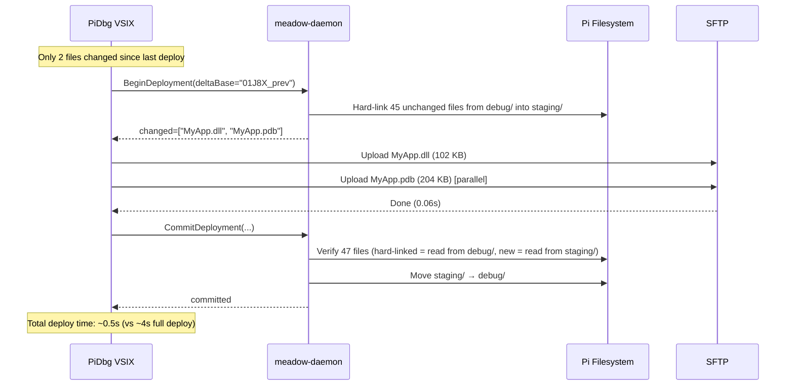

# PiDbg — Deployment System Design

End-to-end design for the publish → transfer → activate → start workflow, covering
both the VSIX orchestration layer and the daemon-side activation layer.

---

## 1. Publish Pipeline

### 1.1 dotnet publish Configuration

The VSIX invokes `dotnet publish` via `IBuildManager` (CPS) with explicit parameters:

```
dotnet publish
  --configuration Debug
  --runtime linux-arm64
  --no-self-contained
  --no-restore          (restore runs as part of normal build)
  -p:PublishSingleFile=false
  -p:Optimize=false
  -p:DebugType=portable
  -p:DebugSymbols=true
  -p:EmbedAllSources=true
  -p:Deterministic=true
```

**Why framework-dependent (`--no-self-contained`)**:
- Publish output: ~50–200 files, 2–15 MB typical
- Self-contained: ~300 files, 60–100 MB — unacceptable transfer cost per iteration
- .NET 10 runtime is pre-installed on the Pi (part of provisioning)

**Why `Optimize=false`**:
- Required for accurate locals, watch expressions, and async state machine debugging
- The `Debug` configuration already sets this; explicit flag prevents project overrides

**Why `Deterministic=true`**:
- Identical source produces identical binary — makes SHA-256 delta detection reliable
- Without this, build timestamps in PE metadata cause false "changed" signals

**Why `EmbedAllSources=true`**:
- Source content embedded in PDB — eliminates source path mapping for all developers
- Checksum mismatches become impossible (PDB is self-consistent)
- Adds ~5–20% to PDB size; negligible transfer cost

### 1.2 Publish Output Structure

```
publish/
├── MyApp.dll             # Managed assembly (entry point)
├── MyApp.pdb             # Portable PDB — symbols + embedded source
├── MyApp.deps.json       # Dependency manifest
├── MyApp.runtimeconfig.json
├── SomeDependency.dll
├── SomeDependency.pdb    # Dependency symbols (if available)
├── appsettings.json      # App configuration
└── runtimes/
    └── linux-arm64/
        └── native/
            └── ...       # Native ARM64 libs (if any)
```

PDB files travel with their DLLs. This is non-negotiable — vsdbg reads the PDB from
the same directory as the assembly. Stripping PDBs from the transfer breaks debugging.

### 1.3 VSIX Build Integration

```
RaspberryPiLaunchProvider.PrepareDebugTargetAsync
    │
    ├── VsBuildService.BuildAndPublishAsync(project, "Debug", "linux-arm64")
    │     │
    │     ├── IBuildManager.BuildAsync(target: "Restore")    [if needed]
    │     ├── IBuildManager.BuildAsync(target: "Publish",
    │     │       properties: { Configuration, RuntimeIdentifier, ... })
    │     └── Returns: PublishResult(outputDir, fileList, totalBytes)
    │
    └── Continue to packaging / transfer
```

If the build fails, `PrepareDebugTargetAsync` surfaces the error and the F5 flow
terminates before any Pi interaction begins.

---

## 2. Package Format

### 2.1 Design Decision: No Archive

The deployment does **not** use a tar/zip archive as the transfer unit. Files are
transferred individually via SFTP directly to the staging directory.

**Rationale:**

| Property | Archive (tar.gz) | Direct SFTP |
|---|---|---|
| Transfer | Single file, sequential | Many files, parallel |
| Pack time (dev machine) | 200–500ms | Zero |
| Unpack time (Pi) | 200–500ms (CPU-bound on ARM64) | Zero |
| Delta support | Requires re-pack whole archive | Skip unchanged files natively |
| Partial failure recovery | Entire transfer must restart | Resume at failed file |
| LAN transfer overhead | Compression saves little at LAN speeds | N/A |
| WAN transfer overhead | Compression saves significantly | N/A |

For a typical LAN/USB-tethered debug scenario (~100 Mbps), 4 MB transfers in ~0.3s.
The archive round-trip costs 400–1000ms with zero benefit. Direct parallel SFTP is
faster in every real-world case.

**Future consideration**: For WAN deployments (Pi over mobile hotspot, cloud CI), an
optional archive mode with compression can be added. The manifest format already
supports this — it's a transfer optimization, not a format change.

### 2.2 Deployment Manifest

The manifest is the canonical description of a deployment. It is written to the
staging directory by the VSIX before any files are transferred, so the daemon can
validate the upload on commit.

**Filename**: `manifest.json` — present in every version dir and the debug dir.

#### Schema

```json
{
  "manifestVersion": 1,
  "deploymentId": "01J8XMKQ4VTQNJ7KGFR3D0000",
  "appName": "MyApp",
  "slot": "Debug",
  "versionLabel": "debug",
  "entryPoint": "MyApp.dll",
  "startupArgs": "--log-level Debug",
  "environment": {
    "DOTNET_ENVIRONMENT": "Development",
    "DOTNET_SYSTEM_CONSOLE_ALLOW_ANSI_COLOR_REDIRECTION": "1"
  },
  "buildInfo": {
    "configuration": "Debug",
    "targetFramework": "net10.0",
    "runtimeIdentifier": "linux-arm64",
    "optimize": false,
    "embeddedSources": true,
    "deterministic": true
  },
  "sourceInfo": {
    "gitCommit": "a1b2c3d4",
    "solutionPathHash": "sha256:9f4e2a..."
  },
  "files": [
    {
      "path": "MyApp.dll",
      "sizeBytes": 102400,
      "sha256": "3a7f...",
      "role": "entryPoint"
    },
    {
      "path": "MyApp.pdb",
      "sizeBytes": 204800,
      "sha256": "8b2c...",
      "role": "symbols"
    },
    {
      "path": "MyApp.deps.json",
      "sizeBytes": 4096,
      "sha256": "1d9e...",
      "role": "config"
    }
  ],
  "totalFiles": 47,
  "totalBytes": 4194304,
  "manifestSha256": "e5f1...",
  "builtAt": "2026-05-09T10:23:40.000Z",
  "deployedAt": "2026-05-09T10:23:44.000Z"
}
```

#### Field notes

- `deploymentId`: ULID — lexicographically sortable, includes timestamp, globally unique. Correlates log entries across VSIX and daemon.
- `manifestVersion`: For forward compatibility. Current = 1.
- `slot`: `"Debug"` or `"Production"` — drives daemon-side activation path.
- `versionLabel`: `"debug"` for debug slot; `"000003"` etc. for production slot.
- `sourceInfo.solutionPathHash`: SHA-256 of the normalized solution file path. Used to detect when the same app is deployed from a different machine (future multi-developer scenario).
- `files[].role`: `"entryPoint"`, `"symbols"`, `"config"`, `"assembly"`, `"native"` — used for selective transfer in delta mode.
- `manifestSha256`: Hash of the manifest JSON itself (computed after serialization, field set to empty string during computation). Sent separately in `CommitDeploymentRequest` so the daemon can verify manifest integrity.

---

## 3. Transfer Strategy

### 3.1 SFTP Parallel Upload

SFTP transfers run over the existing SSH session (same `SshClient`), but on separate
SFTP sub-sessions. SSH.NET supports multiple concurrent SFTP clients on one connection.

```
SshClient (one per device, persistent)
    │
    ├── SftpClient #1 ──────────────────┐
    ├── SftpClient #2 ──────────────────┤  Parallel uploads to Pi staging/
    ├── SftpClient #3 ──────────────────┤
    └── SftpClient #4 ──────────────────┘
```

**Concurrency**: 4 SFTP clients by default. Configurable via `SftpConcurrency` in
`DaemonOptions`. 4 is empirically optimal for Pi 4/5 over 100 Mbps LAN — beyond 4
the SSH multiplexer overhead outweighs parallelism gains.

### 3.2 File Transfer Ordering

Files are sorted into priority tiers before transfer:

| Tier | Files | Reason |
|---|---|---|
| 1 (first) | Large assemblies (>500 KB) | Fill the pipe immediately |
| 2 | PDB files | Large, changed when code changes |
| 3 | Small assemblies (<500 KB) | Many files, benefit most from parallelism |
| 4 (last) | Config, runtimeconfig, deps.json | Tiny; write last so app starts with consistent config |

The manifest is written to staging first (before any file transfer), so the daemon
has the expected checksum list available for concurrent verification.

### 3.3 Delta Transfer

On every deployment, the VSIX checks whether the previously-deployed manifest is
available locally (cached in `%LOCALAPPDATA%\PiDbg\deployments\{deviceId}\{appName}\last-manifest.json`).

```
VSIX: Load last-manifest.json (if exists)
    │
    ├── For each file in current publish output:
    │     Compare SHA-256 with last-manifest entry for same path
    │     If SHA-256 matches → skip transfer (file already on Pi)
    │     If SHA-256 differs or file is new → queue for transfer
    │
    └── Transfer only the changed set
```

The daemon treats any file in staging as authoritative. Files that were not
re-transferred remain from the previous staging contents only if the staging dir
was not cleared — but staging is always cleared on `BeginDeployment`, so delta
transfer requires a different staging strategy:

**Delta staging flow**:
1. `BeginDeployment(slot=Debug, files=ALL, deltaBase=lastDeploymentId)` — new parameter
2. Daemon: if `deltaBase` matches current debug slot's `deploymentId`:
   - Copy unchanged files from `debug/` into `staging/` using hard links (zero copy)
   - Report which files still need uploading
3. VSIX: upload only the changed files
4. `CommitDeployment` — verify all files, activate as normal

Hard links share the inode — no disk copy occurs. The "copy" is instantaneous and
uses no additional disk space until the file is modified. On `Directory.Move(staging→debug)`,
hard links remain valid.

**Delta detection stats** (typical iterative change):
- Change one method body: 1–3 files changed (assembly + PDB + optional deps.json)
- Transfer: 200 KB–2 MB instead of 4–15 MB
- Speed improvement: 5–10× faster deployment for single-file changes

### 3.4 Transfer Progress

Transfer progress is computed by the VSIX and reported to the VS output window and
status bar:

```
[PiDbg] Deploying MyApp (47 files, 4.1 MB)
[PiDbg]   Uploading: 3/47 files (1.2/4.1 MB) — 38 KB/s
[PiDbg]   Uploading: 15/47 files (2.8/4.1 MB) — 82 KB/s
[PiDbg]   Uploading: 47/47 files (4.1/4.1 MB) — 76 KB/s
[PiDbg]   Verifying 47 files...
[PiDbg]   Deployment committed (v:debug, id:01J8X...)
```

Progress is driven by SSH.NET's `IAsyncResult` upload callbacks, aggregated every
250ms to avoid flooding the output window.

---

## 4. Remote Filesystem Layout

```
/opt/meadow/apps/{AppName}/
│
├── versions/                          # Production deployments only
│   ├── 000001/                        # Oldest retained
│   │   ├── manifest.json
│   │   ├── MyApp.dll
│   │   ├── MyApp.pdb
│   │   └── ...
│   ├── 000002/
│   │   └── ...
│   └── 000003/                        # Current production (symlink target)
│       ├── manifest.json
│       ├── MyApp.dll
│       └── ...
│
├── active ──→ versions/000003        # Symlink — atomic production activation
│
├── debug/                             # Debug slot — single directory, always replaced
│   ├── manifest.json
│   ├── MyApp.dll
│   ├── MyApp.pdb
│   └── ...
│
└── staging/                           # Transient — exists only during active deploy
    ├── manifest.json                  # Written first (before files)
    ├── MyApp.dll
    └── ...                            # Files accumulate during upload
```

### Filesystem invariants

1. `active` always points to a valid, complete `versions/NNNNNN/` directory
2. `staging/` is never present when no deploy is in progress
3. `debug/manifest.json` always matches the deployed debug build (or doesn't exist)
4. A `versions/NNNNNN/` directory without a `manifest.json` is incomplete (crash recovery case)
5. The symlink target is always a relative path (`versions/000003`, not absolute)

### Disk usage estimation

| Component | Typical size | Notes |
|---|---|---|
| Single debug deployment | 4–15 MB | Framework-dependent .NET 10 app |
| Three production versions | 12–45 MB | Default retention count = 3 |
| vsdbg | ~60 MB | Installed once per device |
| State files | < 100 KB | apps.json, sessions.json |
| **Total** | **~80–120 MB** | Well within SD card budgets |

---

## 5. Activation Strategy

### 5.1 Debug Slot Activation

```
CommitDeployment(slot=Debug)
    │
    ├── 1. ManifestVerifier.VerifyAsync(stagingPath, manifest)
    │         SHA-256 all files in parallel (hardware-accelerated on ARM64)
    │         Fail fast on first mismatch
    │
    ├── 2. if Directory.Exists(debug/)
    │         Directory.Delete(debug/, recursive=true)
    │         [Safe: app is stopped before CommitDeployment is called]
    │
    ├── 3. Directory.Move(staging/, debug/)
    │         Atomic on ext4 — same volume, directory rename = single inode op
    │
    └── 4. StateStore.UpdateDebugManifestAsync(appName, deploymentId)
```

`Directory.Move` on Linux/ext4 within the same mount point is a `rename(2)` syscall —
atomic, O(1), no data movement. The old `debug/` is gone and the new one appears
instantaneously from any observer's perspective.

### 5.2 Production Slot Activation

```
CommitDeployment(slot=Production)
    │
    ├── 1. ManifestVerifier.VerifyAsync(stagingPath, manifest)
    │
    ├── 2. targetDir = versions/{versionLabel}/
    │         Directory.Move(staging/, targetDir)     ← atomic
    │
    ├── 3. Atomic symlink swap:
    │         symlink("versions/{versionLabel}", "active.new")
    │         rename("active.new", "active")          ← atomic
    │         [active now points to new version]
    │
    ├── 4. PruneDeploymentsAsync(keepCount)
    │         Delete oldest versions/ subdirs beyond retention
    │
    └── 5. StateStore.UpdateAppRecordAsync(appName, versionLabel, deploymentId)
```

The two-step symlink swap (`symlink` + `rename`) is the standard Linux pattern for
atomic symlink replacement. `rename(2)` is guaranteed atomic by POSIX. Any reader of
`active` sees either the old target or the new target — never an intermediate state.

### 5.3 Activation Safety Precondition

The daemon **does not** stop the app as part of activation. The VSIX is responsible
for calling `StopApplication` before `CommitDeployment`. This separation keeps
activation fast (no process management latency) and auditable (each step is a distinct
gRPC call in the log).

For the debug slot specifically, the app must be stopped before activation because
`Directory.Delete(debug/)` will fail if any DLL in `debug/` is memory-mapped by the
running process (Linux doesn't lock files, but deleting a directory with open file
handles is unpredictable).

---

## 6. Deployment Sequence

### 6.1 Full F5 Debug Deployment

```mermaid
sequenceDiagram
    participant Dev as Developer
    participant VS as Visual Studio
    participant VSIX as PiDbg VSIX
    participant SSH as SSH Session
    participant SFTP as SFTP Client(s)
    participant Daemon as meadow-daemon (gRPC)
    participant FS as Pi Filesystem

    Dev->>VS: Press F5
    VS->>VSIX: PrepareDebugTargetAsync()

    Note over VSIX: Phase 1 — Build
    VSIX->>VS: IBuildManager.BuildAsync(Publish, Debug, linux-arm64)
    VS-->>VSIX: PublishResult(dir, 47 files, 4.1 MB)

    Note over VSIX: Phase 2 — Delta Check
    VSIX->>VSIX: Load last-manifest.json (if cached)
    VSIX->>VSIX: Diff: 3 files changed (1.8 MB)

    Note over VSIX: Phase 3 — Prepare Remote
    VSIX->>Daemon: StopApplication(appName)
    Daemon->>FS: SIGTERM → wait → SIGKILL
    Daemon-->>VSIX: StopResponse(exitCode=0)

    VSIX->>Daemon: BeginDeployment(appName, slot=Debug, files, deltaBase=lastId)
    Daemon->>FS: Clear staging/ ; hard-link unchanged files from debug/
    Daemon-->>VSIX: BeginDeploymentResponse(deploymentId, stagingPath, changed=[3 files])

    Note over VSIX: Phase 4 — Transfer
    VSIX->>VSIX: Write manifest.json locally
    par Upload manifest + 3 changed files in parallel
        VSIX->>SFTP: Upload manifest.json → staging/manifest.json
        VSIX->>SFTP: Upload MyApp.dll → staging/MyApp.dll
        VSIX->>SFTP: Upload MyApp.pdb → staging/MyApp.pdb
    end
    SFTP-->>VSIX: All uploads complete (1.8 MB in 0.4s)

    Note over VSIX: Phase 5 — Commit
    VSIX->>Daemon: CommitDeployment(deploymentId, appName, slot=Debug, manifest)
    Daemon->>FS: SHA-256 verify 47 files (0.2s)
    Daemon->>FS: Delete debug/ ; Move staging/ → debug/
    Daemon->>FS: Write StateStore
    Daemon-->>VSIX: CommitResponse(success=true, versionLabel="debug")

    VSIX->>VSIX: Cache manifest as last-manifest.json

    Note over VSIX: Phase 6 — Start + Attach
    VSIX->>Daemon: StartApplication(appName, useDebugSlot=true)
    Daemon->>FS: spawn dotnet MyApp.dll (from debug/)
    Daemon-->>VSIX: StartResponse(pid=4829)

    VSIX->>Daemon: StartDebugSession(appName, mode=Attach, correlationId)
    Daemon->>FS: vsdbg --server --port 4024 --attach 4829
    Daemon-->>VSIX: StartSessionResponse(sessionId, vsdbgPort=4024)

    VSIX->>SSH: ForwardedPortLocal(portB → Pi:4024)
    VSIX->>VS: DebugLaunchSettings(port=portB)
    VS-->>Dev: Debugger attached — breakpoints active
```

### 6.2 Delta Deployment (Subsequent F5)



---

## 7. Integrity Verification

### 7.1 Verification Layers

```
Layer 1: Pre-transfer (VSIX side)
    Compute SHA-256 of each published file immediately after build.
    Embed in manifest. This is the ground truth.

Layer 2: Transfer verification (implicit)
    SFTP uses SSH transport (encrypted + MAC-verified).
    In-transit corruption is detected and retried by SSH.

Layer 3: Post-transfer verification (daemon side)
    Before activation, daemon verifies every file against manifest SHA-256.
    Parallel verification using Environment.ProcessorCount workers.
    Any mismatch → abort, report specific failing file.

Layer 4: Manifest integrity (VSIX → daemon)
    CommitDeploymentRequest includes manifestSha256 (hash of manifest JSON).
    Daemon verifies the manifest file in staging matches this hash before
    trusting the file list within it.
```

### 7.2 Verification Failure Handling

```
Verification fails on file X:
    │
    ├── Daemon returns CommitDeploymentResponse(success=false, failingFile="MyApp.dll",
    │       expectedSha256="3a7f...", actualSha256="9b2e...")
    │
    ├── VSIX: log "Deployment verification failed: MyApp.dll checksum mismatch"
    │
    ├── VSIX: AbortDeployment (staging cleared)
    │
    ├── VSIX: retry once (re-upload the failing file, re-commit)
    │
    └── If retry fails: surface error InfoBar "Deployment failed — checksum mismatch
            on MyApp.dll. Check disk space and SSH connection stability."
```

### 7.3 Manifest Checksum Computation

```
VSIX side (before BeginDeployment):

1. For each file in publish output:
   sha256 = ComputeSHA256(File.OpenRead(localPath))
   Add to manifest.Files

2. Serialize manifest to JSON (field manifestSha256 = "")

3. manifestSha256 = ComputeSHA256(Encoding.UTF8.GetBytes(manifestJson))

4. Re-serialize with manifestSha256 filled in
   [Note: this changes the JSON — manifestSha256 must be the last field
    or computed over the content excluding the manifestSha256 field itself]

Implementation: compute over all content except manifestSha256 field.
Simpler: compute SHA-256 over canonicalized file list (sorted by path,
  each entry: path + "|" + sha256 + "\n"). Store that as manifestSha256.
  This avoids the circular hash problem entirely.
```

---

## 8. Rollback Strategy

### 8.1 Production Rollback

Production rollback is a single symlink update — no file copies, no transfers:

```
SetActiveVersion(appName, "000002")
    │
    ├── Verify versions/000002/ exists and has valid manifest.json
    ├── symlink("versions/000002", "active.new")
    ├── rename("active.new", "active")    ← atomic
    └── Update StateStore

Elapsed time: < 5ms
```

The app must be stopped and restarted by the caller after rollback.

### 8.2 Debug Slot — No Rollback

The debug slot has no rollback. The previous debug deployment is overwritten on every
F5. If the developer needs the previous state, they should use the production slot with
explicit version labels.

This matches the developer mental model: "debug is what I just built."

### 8.3 Rollback via VSIX

The Device Manager UI exposes a deployment history panel that lists retained production
versions. The developer can click "Roll back to v000002" which calls `SetActiveVersion`
followed by `RestartApplication`.

This is an explicit, deliberate action — not an automatic failure recovery.

---

## 9. Cleanup Strategy

### 9.1 Automatic Pruning

After each successful production `CommitDeployment`, the daemon automatically prunes:

```
PruneDeploymentsAsync(keepCount = DeploymentRetentionCount = 3)
    │
    ├── List all versions/ subdirs: [000001, 000002, 000003, 000004]
    ├── Active version = "000004" (never pruned)
    ├── Keep newest N-1 non-active = [000002, 000003]
    ├── Prune = [000001]
    └── Directory.Delete(versions/000001, recursive=true)
```

Active version is always preserved regardless of `keepCount`. If `keepCount = 1`, only
the active version is retained (no rollback history).

### 9.2 Staging Cleanup

Staging is cleaned up in all paths:
- **Commit succeeds**: staging moved to version dir (no longer exists)
- **Abort called**: `StagingController.AbortStagingAsync` deletes staging
- **Deploy in progress → new deploy requested**: `BeginStagingAsync` deletes and
  recreates staging (cancelling the previous deploy implicitly — see §12)
- **Daemon restart with staging present**: `ProcessMonitorService.ReconcileStateAsync`
  finds orphaned staging and deletes it at startup

### 9.3 Debug Slot Cleanup

The debug directory is deleted as part of every new debug deployment activation (§5.1).
Explicit cleanup is not needed.

When a device is unprovisioned from the Device Manager:
1. `StopApplication` for all apps
2. `rm -rf /opt/meadow/apps/{AppName}` via SSH exec
3. Remove device from DeviceRegistry

---

## 10. Concurrency Handling

### 10.1 Concurrent Deploy Requests

The daemon holds a `SemaphoreSlim(1)` per app name. If a second deploy arrives while
the first is in progress:

```
Option A (Reject):
    Return gRPC Status.Aborted "Deploy already in progress for MyApp"
    VSIX: wait and retry

Option B (Queue):
    Block until first deploy finishes, then start second
    Risk: developer gets stale deploy if they F5 twice rapidly

Option C (Cancel-and-Replace) ← CHOSEN for Debug slot:
    Cancel the in-progress deploy (delete staging, release lock)
    Start new deploy immediately
    VSIX receives the Aborted status and begins fresh BeginDeployment
```

**Debug slot** uses Cancel-and-Replace — developer hitting F5 again means they want
the new build, not the one they just cancelled.

**Production slot** uses Queue — OTA deploys should complete without being cancelled
by a concurrent debug operation.

### 10.2 VSIX-Side Cancellation Token

Every deploy operation carries a `CancellationToken` sourced from the session
`CancellationTokenSource`. If the developer stops before deployment finishes:

```
Developer presses Stop / closes VS
    │
    ├── Session CancellationToken fires
    ├── All pending SFTP uploads cancelled (SSH.NET respects ct on async ops)
    ├── VSIX calls AbortDeployment(deploymentId) — best-effort, fire-and-forget
    └── SSH session close also causes daemon to detect gRPC disconnect
        → daemon releases semaphore via IAsyncDisposable pattern on gRPC call
```

### 10.3 Multiple Apps

Different apps deploy concurrently — each has its own semaphore. A production OTA
deploy of AppA and a debug deploy of AppB can proceed simultaneously.

---

## 11. Deployment Cancellation

### 11.1 Cancellation Points

Cancellation can occur at any point in the pipeline:

```
BeginDeployment          → daemon clears staging (or nothing to clear)
  ↓
Manifest upload          → SFTP cancel; daemon: staging has partial manifest → clear on next Begin
  ↓
File uploads (parallel)  → SFTP cancel; partial files in staging
  ↓
CommitDeployment         → cancelled during SHA-256 verify; staging cleared via AbortDeployment
  ↓
[activation]             → if cancelled here, either old or new is active (never half-state)
```

**Key invariant**: Activation is a single atomic operation (Directory.Move or rename).
The cancellation window that could cause a half-active state doesn't exist.

### 11.2 Recovery After Cancelled Deploy

After cancellation, the system state:
- App: still stopped (StopApplication was called before deploy)
- Debug slot: still has previous deployment (or nothing if this was first deploy)
- Staging: being cleared by daemon

If the developer presses F5 again, the VSIX starts a fresh `BeginDeployment`. The
`StagingController.BeginStagingAsync` ensures staging is clean before starting.

---

## 12. Deployment Progress Reporting

### 12.1 Progress Model

Progress flows from the SFTP layer through the VSIX to VS UI surfaces:

```
SftpClient.BeginUploadFile(progress callback)
    │ fires every ~64 KB
    │
    ▼
DeploymentProgressTracker
    │ Aggregates across all parallel SFTP clients
    │ Throttles to one UI update per 250ms
    │
    ▼
IVsOutputWindowService.WriteLineAsync("[PiDbg] Uploading: 23/47 files (2.1/4.1 MB)")
IVsStatusBarService.SetTextAsync("PiDbg: Deploying MyApp... 51%")
```

### 12.2 Progress Phases

| Phase | Output window | Status bar |
|---|---|---|
| Building | VS build output (normal) | "PiDbg: Building..." |
| Connecting | "[PiDbg] Connecting to Dev Board (192.168.1.100)..." | "PiDbg: Connecting..." |
| Stopping app | "[PiDbg] Stopping MyApp..." | "PiDbg: Stopping app..." |
| Preparing | "[PiDbg] Preparing deployment (3 files changed)..." | "PiDbg: Preparing..." |
| Uploading | "[PiDbg] Uploading: 15/47 files (2.8/4.1 MB)" | "PiDbg: Uploading 68%" |
| Verifying | "[PiDbg] Verifying 47 files..." | "PiDbg: Verifying..." |
| Activating | "[PiDbg] Activating deployment..." | "PiDbg: Activating..." |
| Starting app | "[PiDbg] Starting MyApp..." | "PiDbg: Starting..." |
| Starting vsdbg | "[PiDbg] Starting debugger..." | "PiDbg: Attaching..." |
| Ready | "[PiDbg] Debugger attached — MyApp (PID 4829)" | "PiDbg: Debugging" |

### 12.3 Timing Budget

Target total F5 → breakpoint time for a typical iterative change (2–3 files changed):

| Phase | Time | Notes |
|---|---|---|
| Build | 1–5s | Incremental build; VS caches unchanged assemblies |
| Delta compute | < 0.1s | SHA-256 comparison in memory |
| Stop app | 0.1–2s | Graceful exit; usually fast |
| Begin deployment | < 0.1s | gRPC round trip |
| Transfer (2–3 files) | 0.1–0.5s | 200–400 KB at LAN speeds |
| Commit (verify) | 0.1–0.3s | Parallel SHA-256 on ARM64 |
| Start app | 0.5–2s | .NET startup |
| Start vsdbg + attach | 0.5–1.5s | vsdbg already installed |
| SSH tunnel + VS attach | 0.2–0.5s | |
| **Total** | **~3–10s** | vs 30–60s without delta transfer |

---

## 13. Failure Recovery

### 13.1 Failure Mode Map

```
Failure point               │ State left on Pi         │ Recovery
────────────────────────────┼──────────────────────────┼──────────────────────────────
Build fails                 │ Pi unchanged             │ Fix build errors, re-F5
SSH connect fails           │ Pi unchanged             │ Check device power / network
StopApplication hangs       │ App running (stale)      │ SIGKILL after grace period
BeginDeployment fails       │ Pi unchanged             │ Retry (daemon logs error)
Upload fails (partial)      │ staging/ has partial     │ BeginDeployment clears staging
Checksum mismatch           │ staging/ has bad file    │ AbortDeployment, re-upload
Commit fails (disk full)    │ staging/ present         │ User clears space; AbortDeploy
Daemon crash mid-commit     │ staging/ or partial      │ Startup reconciliation cleans up
Daemon crash mid-symlink    │ active.new exists        │ rename is atomic; either old or
                            │                          │ new is live, never both
App won't start             │ debug/ has new build     │ VSIX shows error; developer fixes
vsdbg won't start           │ App running, no vsdbg    │ StopSession, show error + log
```

### 13.2 Startup Reconciliation (Daemon)

On daemon startup, `ProcessMonitorService.ReconcileStateAsync` handles:

1. **Orphaned staging**: `staging/` exists with no active deploy → delete it
2. **Incomplete version dir**: `versions/NNNNNN/` exists without `manifest.json` → mark as corrupt, do not activate, log warning
3. **Dangling symlink**: `active` points to non-existent directory → clear symlink, mark app as "no active version"
4. **`active.new` leftover**: `active.new` exists (interrupted symlink swap) → complete the rename (the interrupted deploy's staging is gone, versions dir is present = deploy succeeded up to the rename)

### 13.3 Retry Policy (VSIX)

```
Upload failure:
    Polly: Retry(3) with 1s exponential backoff
    On 3rd failure: AbortDeployment + surface error

CommitDeployment failure (checksum):
    Retry once with full re-upload (not delta — use clean base)
    On second failure: surface error with specific failing file

SSH disconnect during upload:
    Polly reconnect SSH, re-establish SFTP
    Resume upload from last successfully uploaded file (tracked in progress list)
    [Not byte-resume — SFTP file must be re-uploaded from start if partial]
```

---

## 14. Performance Optimization

### 14.1 Implemented in V1

| Optimization | Impact | Implementation |
|---|---|---|
| Parallel SFTP (4 channels) | 3–4× faster for many-file deploys | SSH.NET multiple SftpClient instances |
| Delta transfer | 5–10× faster for incremental changes | Manifest SHA-256 diff + hard links |
| Large-files-first ordering | Better pipeline utilization | Sort by size descending before tier assignment |
| Framework-dependent publish | 10–15× smaller than self-contained | `--no-self-contained` publish flag |
| Deterministic builds | Correct delta detection | `<Deterministic>true</Deterministic>` |
| Parallel SHA-256 verify | 4× faster verification on quad-core Pi | `Parallel.ForEachAsync` |

### 14.2 Future Optimizations

**Binary delta (V2)**:
- Use `bsdiff` or `.NET`'s `BinaryDelta` to compute byte-level patches for changed DLLs
- Patch size for a small method change: ~5 KB vs ~100 KB full assembly
- Requires patch application on Pi side (daemon)
- Worth implementing if developers frequently use slow connections

**Compression (WAN / mobile)**:
- For transfers > 5 MB over connections < 10 Mbps, enable zstd compression
- Auto-detect based on measured SSH throughput
- Transparent to the manifest/activation system

**Pre-staging (speculative)**:
- While build is running, begin cleaning staging and pre-positioning hard links
- Shaves 100–200ms off the happy path

**Persistent SFTP session pool**:
- Keep SFTP clients alive between deployments (reuse rather than reconnect per session)
- Saves 50–100ms connection overhead per deploy

---

## 15. Hot Reload Compatibility

### 15.1 What Hot Reload Requires

.NET Hot Reload (Edit and Continue at runtime) uses:
1. **IL delta**: the changed method body in IL
2. **Metadata delta**: assembly metadata changes (new types, signatures)
3. **PDB delta**: updated source mapping for changed IL

These are produced by the Roslyn compiler's `EmitDifference` API, invoked by VS when
the developer saves a file during a debug session.

Hot Reload requires `Optimize=false` — already enforced by our debug build config.

### 15.2 Current Architecture's Compatibility

The current deployment system does not break Hot Reload compatibility. It establishes
it:

| Prerequisite | Status |
|---|---|
| `Optimize=false` enforced | ✅ Explicit publish flag |
| `EmbedAllSources=true` | ✅ Symbols remain valid after source edits |
| Deterministic builds | ✅ Delta baseline is reliable |
| vsdbg in Attach mode | ✅ vsdbg supports Hot Reload via attached process |
| `deploymentId` tracks baseline | ✅ Identifies which DLL the delta applies to |

### 15.3 Future Hot Reload Integration Path

When VS triggers Hot Reload during a debug session, the IL/metadata/PDB deltas are
currently applied to the VS debug engine's in-process view. For a remote process, they
need to be forwarded to the Pi.

**Proposed extension (V2)**:

```
VS Hot Reload event
    │
    VSIX: intercept IVsHotReloadManager.ApplyChangesAsync callback
    │
    VSIX: serialize IL delta + metadata delta + PDB delta
    │
    VSIX: gRPC ApplyHotReload(sessionId, deploymentId, deltaFiles)
    │
    Daemon: forward deltas to the running process via:
              /proc/{pid}/... diagnostic API
              OR
              CoreCLR's EventPipe + MetadataUpdate channel
```

New gRPC RPCs required (not yet in proto):
```protobuf
rpc ApplyHotReload(ApplyHotReloadRequest) returns (ApplyHotReloadResponse);

message ApplyHotReloadRequest {
  string session_id    = 1;
  string deployment_id = 2; // baseline build the delta applies to
  repeated HotReloadDelta deltas = 3;
}

message HotReloadDelta {
  string assembly_name  = 1;
  bytes  il_delta       = 2;
  bytes  metadata_delta = 3;
  bytes  pdb_delta      = 4;
}
```

The `deploymentId` in every manifest is the anchor that ensures the delta was computed
against the same binary that is running on the Pi. If they don't match
(e.g., the developer deployed a new build between edits), the daemon rejects the delta
and VS falls back to full redeploy.

### 15.4 Manifest Fields for Hot Reload

The following manifest fields are specifically included to support future Hot Reload:

- `deploymentId`: Links running binary to the delta baseline
- `buildInfo.optimize`: Verified false before allowing Hot Reload attempt
- `buildInfo.deterministic`: Ensures delta can be matched unambiguously
- `files[].sha256`: The VS delta engine uses the assembly hash to validate baseline
- `sourceInfo.gitCommit`: For diagnostics when delta application fails

---

## 16. Deployment ID Design

Deployment IDs are **ULIDs** (Universally Unique Lexicographically Sortable Identifiers):

```
01ARZ3NDEKTSV4RRFFQ69G5FAV
└──── time ────┘└── rand ──┘
  48-bit ms       80-bit
```

Properties:
- Lexicographic sort = chronological sort — deployment history is naturally ordered
- Globally unique — correlates log entries across VSIX (dev machine) and daemon (Pi)
- 26-character string — compact enough for log lines and filenames
- No coordination required to generate — VSIX generates it locally

The VSIX generates the `deploymentId` before calling `BeginDeployment` and passes it
as a field. The daemon records it without validation (trusts the client ID). The daemon
generates its own internal correlation IDs for daemon-side log entries; the `deploymentId`
is the cross-system correlation key.

---

## 17. Deployment State Machine (VSIX Side)

```
┌──────────┐
│  Idle    │
└────┬─────┘
     │ F5
     ▼
┌──────────┐  Build fails   ┌──────────────┐
│ Building ├───────────────►│ Failed       │
└────┬─────┘                └──────────────┘
     │ Build OK
     ▼
┌──────────────┐  Stop fails  ┌──────────────┐
│ Stopping App ├─────────────►│ Failed       │
└──────┬───────┘              └──────────────┘
       │ App stopped
       ▼
┌──────────────┐
│ Preparing    │  BeginDeployment
└──────┬───────┘
       │
       ▼
┌──────────────┐  Cancelled   ┌──────────────┐
│ Uploading    ├─────────────►│ Cancelled    │
└──────┬───────┘              └──────────────┘
       │ All files uploaded
       ▼
┌──────────────┐  Verify fail ┌──────────────┐
│ Committing   ├─────────────►│ Failed       │
└──────┬───────┘              └──────────────┘
       │ Committed
       ▼
┌──────────────┐
│ Starting App │
└──────┬───────┘
       │ App running
       ▼
┌──────────────┐
│ Attaching    │
└──────┬───────┘
       │ Debugger attached
       ▼
┌──────────────┐
│ Debugging    │  ← Normal debug session
└──────────────┘
```

State transitions fire status bar and output window updates (§12.2). Transitions to
`Failed` or `Cancelled` surface an InfoBar notification with a specific error message
and a suggested corrective action.
